# HRIS PEJUANG: MASTER DOKUMEN

| | |
|---|---|
| Versi | 1.0 |
| Tanggal | 2 November 2026 |
| Status | Acuan tunggal pengembangan (backend, web, mobile) |
| Menggantikan | PRD.md, ERD.md, DESIGN.md, FLOWCHART.md, CHECKLIST.md, ROADMAP.md, QUERY.sql, MCP.md (disimpan sebagai arsip; **bila berbeda, dokumen ini yang berlaku**) |

## Daftar Isi
0. Aturan Emas
1. Tujuan, Ruang Lingkup, Prinsip
2. Glosarium, Penamaan, Format Baku
3. Role, Permission, Scope
4. Arsitektur & Zona Keamanan
5. Keamanan (threat model, auth, anti-fraud, data, privasi, insiden)
6. Kamus Data (tabel, enum, registry)
7. Kontrak API (konvensi, header, error, endpoint, skema JSON)
8. Flowchart Lengkap
9. State Machine
10. Frontend (web & mobile)
11. Backend
12. Alur Pengembangan & Kualitas
13. Roadmap & Checklist
14. Keputusan & Pertanyaan Terbuka
- Lampiran A: Delta SQL · B: Environment Variable · C: Checklist Keamanan per PR

---

## 0. Aturan Emas

1. **Server tidak pernah percaya klien.** Semua validasi, role, geofence, wajah, dan hitungan uang diputuskan di API Go. UI hanya menampilkan.
2. **Tolak secara default.** Endpoint tanpa permission eksplisit = ditolak.
3. **Kontrak dulu, kode kemudian.** Ubah `openapi.yaml` lebih dulu, lalu generate kode server dan klien.
4. **Satu sumber key.** Nama field, enum, kode error, dan permission hanya yang tertulis di dokumen ini (§2, §6, §7). Dilarang mengarang nama baru di kode; tambah dulu di dokumen, lalu di kontrak.
5. **Semua aksi sensitif masuk `audit_logs`** (login, ubah gaji, approval, finalisasi payroll, akses data wajah).
6. **Data pribadi seminimal mungkin.** Wajah dan lokasi adalah data sensitif.
7. **Mudah dipakai.** Absen maksimal 3 ketukan, pesan error berbahasa manusia, status pengajuan selalu terlihat.
8. **Tidak ada rahasia di Git, frontend, maupun log.**

---

## 1. Tujuan, Ruang Lingkup, Prinsip

### 1.1 Tujuan
1. Presensi akurat dan sulit dicurangi (geofence + wajah + anti fake GPS).
2. Menghapus proses manual cuti, izin, kasbon, mutasi, slip upah.
3. Memberi SDM data real-time (struktur organisasi, laporan upah dari presensi).
4. Backend ringan dan cepat saat jam masuk/pulang.
5. Aman dan mudah dipakai, tanpa mengorbankan salah satunya.

### 1.2 Pengguna dan Platform
| Role | Platform | Ringkas |
|---|---|---|
| Pejuang | Mobile | Karyawan |
| Subdiv | Mobile + Web | Atasan langsung, approver tingkat 1 |
| Kadiv | Mobile + Web | Kepala divisi, approver tingkat 2 |
| SDM | Web (+ Mobile) | Admin personalia, semua akses Pejuang + pengelolaan |

### 1.3 Fitur
**Pejuang:** profile, presensi (laporan & rekap), payroll (slip upah PDF), cuti & izin, Surat Peringatan, pengumuman (pop-up & banner), pengajuan mutasi, pengajuan kasbon.
**SDM (tambahan):** buat pengumuman; grafik jumlah Pejuang per subdiv dan jumlah subdiv per divisi; laporan upah berdasarkan presensi; master data; lokasi geofence; review absen berisiko; persetujuan ganti perangkat; payroll; SP.

### 1.4 Di Luar Lingkup Awal
iOS, integrasi mesin fingerprint, transfer gaji otomatis ke bank, BPJS/PPh21 otomatis.

### 1.5 Target Non-Fungsional
| Aspek | Target awal |
|---|---|
| Latensi clock-in (p95) | < 1 detik di server (di luar waktu kamera di HP) |
| RAM API saat idle | < 100 MB |
| Ketersediaan jam masuk | tahan lonjakan serentak (diuji k6 sebelum pilot) |
| Android | minSdk 26, target utama Android 10 |
| Keamanan | Lolos checklist Lampiran C di setiap PR |

### 1.6 Prinsip Keamanan
Defense in depth, least privilege, zero trust ke klien, secure by default, privacy by design, fail closed (ragu = tolak atau tandai `review`, bukan lolos).

---

## 2. Glosarium, Penamaan, Format Baku

### 2.1 Glosarium Istilah (ID → Kode)
| Istilah | Kode (EN) | Arti | Jangan pakai |
|---|---|---|---|
| Pejuang | entitas `employee`, nilai role `pejuang` | Karyawan | karyawan, staff, user (untuk entitas) |
| Akun | `user` | Kredensial login, 1:1 dengan employee | account |
| SDM / Personalia | role `sdm` | Admin personalia | hr, admin |
| Subdiv | entitas `subdivision`, role `subdiv` | Sub divisi / atasan langsung | subvid, team |
| Kadiv | role `kadiv` | Kepala divisi | head, manager |
| Divisi | `division` | Divisi | department |
| Presensi | `attendance` | Catatan kehadiran harian | absensi (di kode) |
| NIPY | `nip` | Nomor induk Pejuang | NIP |
| Ahad | hari ke-7 pada `work_days` | Hari ketujuh | Minggu |
| Al Bahjah | - | Penulisan sesuai akta, tanpa strip | Al-Bahjah |
| Absen masuk / pulang | `clock_in` / `clock_out` (field), `clock-in` / `clock-out` (path) | Aksi presensi | checkin, punch |
| Lokasi kantor (geofence) | `office_location` | Area absen yang sah | site, branch |
| Shift | `shift` | Jam kerja + toleransi | jadwal |
| Tantangan presensi | `attendance_challenge` | Nonce sekali pakai dari server | token absen |
| Percobaan presensi | `attendance_attempt` | Log tiap upaya, diterima maupun ditolak | log absen |
| Skor risiko | `risk_score` | Poin kecurigaan 0-100+ | fraud_score |
| Penanda risiko | `risk_flags` | Daftar sinyal yang terdeteksi | |
| Perangkat | `device` | HP yang terikat ke akun | handset |
| Template wajah | `face_template` | Embedding wajah terenkripsi | foto wajah |
| Cuti & izin | `leave_request`, jenis `leave_type` | Pengajuan tidak masuk | |
| Kasbon | `cash_advance` | Pinjaman gaji | loan, kasbon_request |
| Mutasi | `transfer_request` | Pindah subdiv | mutation |
| Persetujuan | `approval` (satu langkah), `approval_flow` (rantai) | | acc |
| Surat Peringatan | `warning`, level `sp1`/`sp2`/`sp3` | | |
| Pengumuman | `announcement`, tipe `popup`/`banner` | | |
| Slip upah | `payslip` (tampilan Pejuang), `payroll` (data periode) | | |
| Upah | `base_salary`, `gross`, `net` | "ubar" = upah/gaji | |
| Periode upah | `payroll_period` | Bulan penggajian | |
| Sesi | `session` | Satu login (web/mobile) | |
| Audit | `audit_log` | Jejak aksi, tidak boleh diubah | |

Teks UI memakai istilah Indonesia ("Absen", "Pengajuan"), kode memakai kolom "Kode (EN)".

### 2.2 Aturan Penamaan
| Objek | Aturan | Contoh |
|---|---|---|
| Tabel | snake_case, jamak | `leave_requests` |
| Kolom | snake_case | `start_date` |
| Primary key | `id`, UUID v4 | |
| Foreign key | `<entitas>_id` | `subdivision_id` |
| Waktu | `*_at`, `timestamptz`, UTC | `clock_in_at` |
| Tanggal | `*_date`, `date` | `work_date` |
| Jam | `*_time`, `time` | `start_time` |
| Boolean | awalan `is_` / `has_` | `is_active` |
| Jarak / akurasi | akhiran `_m` | `radius_m`, `accuracy_m` |
| Durasi | akhiran `_minutes` | `late_minutes` |
| Uang | DB `NUMERIC(14,2)`, JSON **string** | `"1500000.00"` |
| Nilai enum | lowercase snake_case | `pending_approval` |
| Kode error | UPPER_SNAKE | `GEOFENCE_OUT` |
| Permission | `resource:action` | `employee:write` |
| Event audit | `domain.event` | `auth.login_failed` |
| Path API | kebab-case, jamak | `/v1/cash-advances` |
| Query param | snake_case | `per_page` |
| Key JSON | snake_case | `full_name` |
| Header kustom | `X-Title-Case` | `X-Device-Id` |
| Env var | UPPER_SNAKE | `DATABASE_URL` |
| Go | paket lowercase, tipe PascalCase, file snake_case | |
| TypeScript | tipe hasil generate **tidak diubah** ke camelCase | `full_name` tetap `full_name` |

Path memakai kebab-case, nilai enum memakai snake_case:

| Path | Nilai `request_type` |
|---|---|
| `/v1/leaves` | `leave` |
| `/v1/cash-advances` | `cash_advance` |
| `/v1/transfers` | `transfer` |

### 2.3 Format Baku
- **Waktu API:** RFC 3339 UTC (`2026-11-02T01:00:00Z`). UI menampilkan WIB (`Asia/Jakarta`).
- **`work_date`:** dihitung **server** dengan zona `Asia/Jakarta`, bukan dari jam HP dan bukan `current_date` bawaan DB.
- **Koordinat:** `latitude` (-90..90), `longitude` (-180..180), derajat desimal WGS84, 6 digit. Dilarang `lat`/`lng`/`lon`.
- **Uang:** Rupiah, string desimal 2 digit. Tidak pernah `float`.
- **ID:** UUID huruf kecil bertanda hubung.
- **Bahasa:** `code` error stabil dan Inggris; `message` bahasa Indonesia.
- **Paginasi:** `page` mulai 1, `per_page` default 20 maksimum 100.

---

## 3. Role, Permission, Scope

### 3.1 Scope
| Scope | Arti |
|---|---|
| `self` | Data milik sendiri |
| `subdivision` | Pejuang di subdiv yang dipimpin |
| `division` | Pejuang di divisi yang dipimpin |
| `all` | Seluruh data |

Scope dihitung dari struktur organisasi di DB (`subdivisions.head_employee_id`, `divisions.head_employee_id`), bukan dari klaim JWT. Mutasi yang disetujui langsung mengubah scope.

### 3.2 Matriks Permission
Role `superadmin` (D34) adalah role tertinggi dan tidak ditulis sebagai kolom di matriks ini: **semua izin SDM kecuali keuangan**.
- Tidak punya `payroll:manage`, `payroll:finalize`, dan `cash_advance:read` milik orang lain. `base_salary` orang lain tidak tampil dan tidak bisa diubah; Pejuang yang dibuatnya bergaji 0 sampai diisi SDM.
- Bisa mengelola semua akun, kecuali menerbitkan tautan sandi untuk akun SDM (D33).
- SDM tidak bisa mengunci, mereset, mengubah, menonaktifkan, mengatur lokasi absen, atau mencabut perangkat super admin. Bila lupa kata sandi: `hris-superadmin reset`.
- SDM tetap bisa menyetujui perangkat baru super admin, karena perangkat sendiri harus disetujui peninjau lain. Bila HP super admin hilang, super admin sendiri yang mencabutnya; SDM tidak bisa menggantikan.
- MFA wajib. Role diberikan lewat `hris-superadmin grant --email ...` di server, pada akun Pejuang biasa. Bila akun belum aktif, tautan aktivasi tampil di terminal, karena SMTP baru bisa diatur setelah akun itu ada.
- Penampil audit yang dibuat nanti wajib menyembunyikan nilai `employee.salary_changed` dari super admin.

| Permission key | pejuang | subdiv | kadiv | sdm |
|---|---|---|---|---|
| `profile:read` / `profile:update` | self | self | self | self |
| `org:read` (daftar divisi & subdiv) | ✔ | ✔ | ✔ | ✔ |
| `org:write` | | | | ✔ |
| `employee:read` | | subdivision | division | all |
| `employee:write` | | | | ✔ |
| `user:manage` (kunci, buka kunci, cabut sesi) | | | | ✔ |
| `user:reset` (terbitkan tautan sandi baru) | | | | ✔ |
| `device:register` | self | self | self | self |
| `device:review` | | | | ✔ |
| `face:enroll` | self | self | self | self |
| `face:reset` | | | | ✔ |
| `attendance:clock` | self | self | self | self |
| `attendance:read` | self | subdivision | division | all |
| `attendance:review` | | | | ✔ |
| `attendance:report` | | | division | all |
| `location:manage`, `shift:manage` | | | | ✔ |
| `leave:create`, `cash_advance:create`, `transfer:create` | self | self | self | self |
| `leave:read`, `cash_advance:read`, `transfer:read` | self | subdivision | division | all |
| `approval:act` | | langkah miliknya | langkah miliknya | langkah miliknya |
| `payslip:read` | self | self | self | self |
| `payroll:manage` (buat, generate, submit) | | | | ✔ |
| `payroll:finalize` (harus orang lain dari pembuat) | | | | ✔ |
| `warning:read` | self | self | self | self |
| `warning:manage` | | | | ✔ |
| `announcement:read` | ✔ | ✔ | ✔ | ✔ |
| `announcement:manage` | | | | ✔ |
| `dashboard:read` | | | | ✔ |
| `approval_flow:manage` | | | | ✔ |
| `audit:read` | | | | ✔ |

### 3.3 Aturan Otorisasi Tambahan
1. Subdiv dan Kadiv otomatis memiliki semua permission Pejuang.
2. **Dilarang menyetujui pengajuan sendiri** (`APPROVAL_SELF_FORBIDDEN`).
3. **Maker-checker payroll:** pembuat periode tidak boleh memfinalisasi periode yang sama.
4. Objek di luar scope dijawab **404 `NOT_FOUND`**, bukan 403, agar keberadaan data tidak bocor.
5. Role disimpan di `users.role`; perubahan role dicatat di audit dan mencabut seluruh sesi akun tersebut.
6. UI boleh menyembunyikan menu berdasar `permissions` dari `GET /v1/me`, tetapi **itu hanya kenyamanan**; yang menegakkan adalah API.

---

## 4. Arsitektur & Zona Keamanan

```
Aplikasi HP (Kotlin) ─┐
                      ├─ HTTPS ─► Nginx (TLS, rate limit) ─► API Go ─► PostgreSQL
Web Admin (statis) ───┘                                           ├─► Redis
                                                                  ├─► Object storage privat
                                                                  ├─► FCM
                                                                  └─► Play Integrity API
```

| Zona | Isi | Aturan |
|---|---|---|
| Publik | Nginx, file statis web | Hanya port 443 (80 hanya redirect) |
| Aplikasi | API Go, scheduler | Tidak punya akses internet selain FCM, Google API, HMS (jalur C), dan SMTP |
| Data (privat) | PostgreSQL, Redis, object storage | Tidak terbuka ke internet; hanya dapat dijangkau API |

**Stack:** Go (chi, pgx, sqlc, golang-migrate) · PostgreSQL 16+ · Redis · Next.js (static export) + Refine · Kotlin Jetpack Compose · ML Kit + TFLite MobileFaceNet · FCM · Docker Compose · OpenAPI 3.

Domain terpisah: `admin.<domain>` (web statis) dan `api.<domain>` (API), keduanya satu situs (same-site) sehingga cookie `SameSite=Strict` tetap terkirim.

---

## 5. Keamanan

### 5.1 Threat Model
| # | Ancaman | Kontrol utama |
|---|---|---|
| T1 | Fake GPS / mock location | Deteksi lokal + Play Integrity + validasi server (akurasi, lompatan lokasi) |
| T2 | Absen titipan (orang lain memakai HP/akun) | Wajah + liveness + device binding |
| T3 | Foto/video wajah | Liveness di HP, selfie disimpan untuk audit |
| T4 | App dimodifikasi, hook (Frida), replay request | Play Integrity terikat `request_hash` + nonce sekali pakai |
| T5 | Embedding palsu dikirim dari klien | Nonce + attestation, deteksi embedding identik berulang, sampling verifikasi selfie di server |
| T6 | Token dicuri | Access pendek, cookie HttpOnly (web), Keystore (mobile), rotasi refresh + deteksi reuse |
| T7 | Brute force / credential stuffing | Lockout, rate limit, MFA wajib untuk SDM |
| T8 | IDOR (akses data Pejuang lain) | Cek scope di service, objek di luar scope = 404, tes otomatis |
| T9 | Eskalasi hak (Pejuang memanggil `/admin`) | Permission middleware, deny by default |
| T10 | SQL injection | Hanya sqlc / query berparameter |
| T11 | XSS (isi pengumuman) | Teks murni atau sanitasi, CSP, tanpa `dangerouslySetInnerHTML` |
| T12 | CSRF | Cookie `SameSite=Strict` + header `X-CSRF-Token` |
| T13 | Penyalahgunaan orang dalam (ubah gaji) | Audit append-only, maker-checker payroll |
| T14 | Kebocoran data (backup, log, file) | Enkripsi, tanpa PII di log, bucket privat + signed URL |
| T15 | Lonjakan jam masuk / DDoS | Rate limit, Redis, uji beban |
| T16 | Dependensi rentan | `govulncheck`, `npm audit`, Dependabot, scan image |
| T17 | HP hilang / Pejuang keluar | Cabut sesi + perangkat, nonaktifkan akun |
| T18 | Manipulasi jam HP | Waktu server yang berlaku |

### 5.2 Autentikasi & Sesi
| | Web admin | Mobile |
|---|---|---|
| Endpoint | `/v1/auth/web/*` | `/v1/auth/mobile/*` |
| Access token | JWT 15 menit di cookie `hris_at` (`HttpOnly; Secure; SameSite=Strict; Path=/v1`) | JWT 15 menit, hanya di memori |
| Refresh token | Opaque 256-bit di cookie `hris_rt` (`HttpOnly; Secure; SameSite=Strict; Path=/v1/auth/web`), idle 30 menit, maksimum 12 jam | Opaque 256-bit di Android Keystore, 30 hari, terikat `device_id` |
| Rotasi | Setiap refresh menerbitkan token baru; token lama dipakai ulang = **cabut sesi** | Sama |
| CSRF | Cookie `hris_csrf` + header `X-CSRF-Token` pada semua method selain GET | Tidak perlu |
| MFA | TOTP **wajib untuk `sdm`**, opsional role lain | Tidak (device binding + wajah) |

**JWT:** algoritma EdDSA (Ed25519), `kid` di header untuk rotasi kunci. Klaim:

| Key | Isi |
|---|---|
| `iss` | `hris-api` |
| `aud` | `hris-web` atau `hris-mobile` |
| `sub` | `user_id` |
| `eid` | `employee_id` |
| `role` | `pejuang` / `subdiv` / `kadiv` / `sdm` |
| `sid` | `session_id` (dicek ke DB/Redis; sesi dicabut = token langsung mati) |
| `did` | `device_id` (hanya mobile) |
| `iat`, `exp`, `jti` | standar |

**Kata sandi:** argon2id (titik awal m=64 MiB, t=3, p=2; setel agar ± 250-500 ms), minimal 10 karakter, tolak daftar sandi umum, ganti wajib saat login pertama. Login jarang terjadi (refresh tidak memakai argon2), jadi tidak membebani jam masuk.

**Lockout:** 5 kegagalan berturut-turut mengunci akun 15 menit (naik bertahap), plus rate limit per IP. Pesan gagal selalu generik ("Email atau kata sandi salah").

**Aktivasi akun:** SDM membuat Pejuang → sistem membuat undangan sekali pakai (hash di DB, berlaku 24 jam) → Pejuang menetapkan kata sandi sendiri. SDM tidak pernah mengetahui kata sandi siapa pun. Tautan yang sudah dipakai, diganti, atau kedaluwarsa tidak menampilkan form; halaman menjelaskan keadaannya.

### 5.2.1 Akses Akun Lewat Email Terdaftar (D30)

- Tautan aktivasi dan reset kata sandi **hanya dikirim ke email terdaftar**. Di luar `APP_ENV=development`, API tidak mengembalikan token dan layar SDM tidak menampilkannya; SDM hanya melihat status terkirim atau gagal, dan bisa mengirim ulang.
- **Email tidak pernah memuat kata sandi**, hanya tautan sekali pakai. Yang disimpan di DB hanya hash-nya. Masa berlaku: aktivasi 24 jam, reset 1 jam. Mengirim ulang membatalkan tautan lama.
- **Lupa kata sandi:** `POST /v1/auth/password/forgot` selalu menjawab `202` dengan pesan yang sama agar tidak membocorkan email mana yang terdaftar, dan dibatasi rate limit per email + IP.
- Reset berhasil mencabut semua sesi. MFA tetap diminta saat login berikutnya; reset kata sandi tidak melewati MFA.
- **Ganti email terdaftar:** pemberitahuan dikirim ke email lama, konfirmasi ke email baru, dan email baru berlaku setelah dikonfirmasi. Semua sesi dicabut dan tercatat di audit (`user.email_changed`). Bila Pejuang sudah kehilangan akses ke email lama, SDM menggantinya setelah verifikasi identitas, dan kejadiannya tetap diaudit.
- **Pemberitahuan keamanan** dikirim ke email terdaftar saat kata sandi berubah, MFA diaktifkan atau direset, akun dikunci atau dibuka, dan perangkat baru disetujui.
- Email dikirim setelah transaksi selesai. Token asli tidak disimpan untuk dikirim belakangan: bila pengiriman gagal, statusnya dicatat (`email.delivery_failed`) dan kirim ulang membuat token baru.
- Tautan memakai `PUBLIC_WEB_URL`, wajib HTTPS di luar development, dan halamannya memakai `Referrer-Policy: no-referrer` tanpa sumber daya pihak ketiga.
- **Email perusahaan lewat SMTP, diatur super admin di panel (`settings:manage`):**
  - Kata sandi SMTP disimpan terenkripsi (AES-256-GCM, `fieldcrypt`) dan bersifat tulis-saja: API tidak pernah mengembalikannya, dan tidak masuk log maupun audit.
  - Koneksi wajib TLS dengan sertifikat terverifikasi, hanya port 465 atau 587. Host loopback dan link-local ditolak agar panel tidak bisa dipakai menjangkau layanan internal server.
  - Pengaturan baru baru berlaku setelah uji kirim berhasil. Bila gagal, pengaturan lama tetap dipakai. Uji kirim hanya ke email akun yang sedang login.
  - Setiap perubahan tercatat di audit (`settings.changed`) tanpa nilai rahasia.
  - Kunci enkripsi tetap berupa file di server, tidak bisa diatur lewat panel.
  - Domain pengirim wajib punya SPF, DKIM, dan DMARC, diatur oleh pengelola email perusahaan.

### 5.3 Device Binding
- Setiap perangkat punya `integrity_tier` yang ditetapkan server (§5.4.1).
- Satu akun, satu perangkat `approved`, dijaga juga oleh indeks unik di database.
- Hanya akun yang **belum pernah** punya perangkat yang langsung `approved`. Perangkat lain `pending` sampai SDM atau super admin menyetujui (D25), termasuk setelah perangkat lama dicabut (D32).
- Peninjau tidak bisa menyetujui perangkatnya sendiri. Perangkat yang sudah dicabut tidak bisa disetujui lagi; aplikasi yang dipasang ulang mendaftar sebagai perangkat baru.
- Pejuang yang dinonaktifkan otomatis kehilangan semua perangkatnya.
- `device_hash` = hash dari ID instalasi acak (disimpan di Keystore), bukan IMEI.
- Presensi dari perangkat `pending` atau `revoked` ditolak.
- Perangkat hilang: SDM mencabut perangkat dan seluruh sesi (alur F16).

### 5.4 Anti-Fraud Presensi

**Prinsip:** sinyal dari HP (mock flag, deteksi root) bersifat *saran* karena bisa dipalsukan di HP yang dimodifikasi. Yang dipercaya adalah **bukti integritas perangkat yang diverifikasi server** (jalur per perangkat, §5.4.1) dan validasi server.

**Challenge-response (mencegah replay):**
1. App meminta `POST /v1/attendance/challenge` → server membuat `nonce` acak, berlaku 90 detik, sekali pakai.
2. App menghitung `request_hash = base64url(SHA256(nonce|latitude|longitude|captured_at|selfie_sha256))`, lalu meminta token Play Integrity dengan hash tersebut.
3. Server memastikan: challenge milik user + device, belum dipakai, belum kedaluwarsa; token Integrity valid, paket benar, `request_hash` cocok, `deviceRecognitionVerdict` memuat `MEETS_DEVICE_INTEGRITY`, `appRecognitionVerdict` = `PLAY_RECOGNIZED`, dan cap waktu verdict masih segar.

Level `MEETS_STRONG_INTEGRITY` tidak diwajibkan karena menolak banyak HP Android 10 yang sah.

**Registry penanda risiko (`risk_flags`):**
| Flag | Jenis | Poin / aksi |
|---|---|---|
| `mock_location` | keras | Tolak |
| `fake_gps_app` | keras | Tolak |
| `root_detected` | keras | Tolak |
| `emulator` | keras | Tolak |
| `integrity_failed` | keras | Tolak |
| `integrity_nonce_mismatch` | keras | Tolak |
| `challenge_invalid` | keras | Tolak |
| `device_not_approved` | keras | Tolak |
| `integrity_basic_only` | lunak | +30 |
| `unverified_integrity` (absen tanpa verifikasi, hanya development, D36) | catatan | 0 |
| `off_schedule` (absen di hari libur atau di luar hari kerja shift, tidak dihitung telat) | catatan | 0 |
| `integrity_manual` (perangkat jalur D) | lunak | +30 |
| `integrity_unavailable` (layanan verifikasi tidak terjangkau) | lunak | +30 |
| `accuracy_low` (`accuracy_m` > 50) | lunak | +15 |
| `location_jump` (kecepatan implisit > 120 km/jam dari absen terakhir yang tercatat, dengan jarak minimal 1 km agar gangguan GPS tidak terhitung) | lunak | +40 |
| `face_borderline` | lunak | +20 |
| `liveness_retry` (≥ 2 kali ulang) | lunak | +25 |
| `clock_skew` (jam HP vs server > 5 menit) | lunak | +20 |
| `new_device_recent` (perangkat disetujui < 24 jam) | lunak | +10 |
| `embedding_replay` (embedding identik dengan absen sebelumnya) | keras | Tolak |

**Keputusan skor:** `< 30` → diterima (`present`/`late`); `30-59` → `review`; `≥ 60` → ditolak. Semua upaya (termasuk ditolak) dicatat di `attendance_attempts`. Skor dihitung juga saat absen pulang: skor 30-59 mengubah absen menjadi `review`, penanda digabung, dan skor tertinggi yang disimpan.

**Kebijakan keluaran ke klien:** respons **tidak** memuat `risk_score`, `risk_flags`, atau alasan deteksi keras. Klien hanya menerima `ATTENDANCE_BLOCKED` generik untuk sinyal keamanan, dan kode spesifik untuk hal yang bisa diperbaiki pengguna (`GEOFENCE_OUT`, `FACE_MISMATCH`, `LIVENESS_FAILED`, `CHALLENGE_EXPIRED`). Alasan rinci hanya terlihat oleh SDM.

**Konfigurasi ambang (nilai awal, wajib dikalibrasi dengan data uji nyata):**
| Key | Default |
|---|---|
| `face.threshold_pass` | 0.70 |
| `face.threshold_review` | 0.60 |
| `risk.review_min` | 30 |
| `risk.reject_min` | 60 |
| `challenge.ttl_seconds` | 90 |
| `face.enroll_requires_geofence` | true |

### 5.4.1 Jalur Verifikasi Perangkat (D24)

Semua HP Android didukung lewat jalur berjenjang. Jalur ditetapkan **server** dan disimpan di `devices.integrity_tier`.

| Jalur | Untuk | Bukti yang diverifikasi server | Hasil absen |
|---|---|---|---|
| A `play` | HP dengan Google Play, app dari Play | Play Integrity: `MEETS_DEVICE_INTEGRITY`, `PLAY_RECOGNIZED`, `request_hash` | Normal |
| B `attestation` | HP tanpa Google Play yang mendukung Key Attestation, atau app di luar Play | Rantai sertifikat ke root Google, status CRL, keamanan `TrustedEnvironment`/`StrongBox`, `verifiedBootState` = `Verified`, `deviceLocked`, paket dan sidik jari tanda tangan app, `attestationChallenge` = `request_hash` | Normal |
| C `hms` | HP Huawei dengan HMS | Huawei Safety Detect SysIntegrity dengan nonce dari `request_hash`. Dibangun bila data menunjukkan ada penggunanya | Normal |
| D `manual` | HP Android tanpa bukti di atas | Persetujuan SDM per perangkat setelah diperiksa, berlaku `device.manual_approval_days` (default 90) | **Selalu `review`** (`integrity_manual`) |
| E kiosk | Pejuang tanpa HP yang bisa dipakai, termasuk iPhone dan HP non-Android | Tablet kantor jalur A/B milik perusahaan; Pejuang memasukkan NIPY lalu verifikasi wajah | Normal, geofence mengikuti lokasi kiosk |

**Aturan anti-turun-jalur:**
- Klien tidak bisa memilih jalur. Jalur lebih rendah hanya berlaku setelah disetujui SDM dan tercatat di audit (`device.integrity_tier_changed`).
- Bukti yang **gagal** berarti `integrity_failed` dan ditolak, tanpa pindah otomatis ke jalur lebih rendah. Hanya layanan yang tidak terjangkau yang menjadi `integrity_unavailable`, dan absennya masuk `review`.
- Sinyal keras (mock, root, emulator) dan wajah + liveness tetap berlaku di semua jalur.

**Keterbatasan jalur D:** tidak ada bukti kriptografis, jadi HP yang dimodifikasi dengan rapi tetap bisa memalsukan GPS. Karena itu absennya tidak pernah diterima otomatis.

**Pengganti ketergantungan Google pada app:**
| Kebutuhan | HP dengan Google | HP tanpa Google |
|---|---|---|
| Lokasi | FusedLocationProvider | `LocationManager` bawaan Android |
| Deteksi wajah | ML Kit | Model ML Kit yang dibundel di app (dipastikan saat pengembangan) |
| Notifikasi | FCM | Ambil notifikasi saat app dibuka; HMS Push untuk jalur C |
| Distribusi app | Play Store | APK resmi bertanda tangan sama; AppGallery untuk jalur C |

### 5.4.2 Absen Tanpa Lokasi Tetap: WFA dan Hybrid (D23, D26)

- Satu Pejuang boleh punya banyak lokasi kantor; absen sah di lokasi mana pun yang ditugaskan.
- SDM memberi izin WFA per Pejuang di `employee_work_arrangements`: rentang tanggal (boleh tanpa akhir), hari tertentu (opsional, mis. tiap Jumat), dan alasan. Server menentukan status WFA dari `work_date`; klien tidak bisa memintanya.
- Saat WFA aktif, **hanya geofence yang dilewati**. Perangkat, bukti integritas, sinyal keras, wajah, liveness, dan `location_jump` tetap berlaku.
- GPS tetap wajib dan disimpan sebagai bukti. Detail lokasi hanya untuk SDM, mengikuti persetujuan `location` dan retensi §5.6.
- `attendances` menyimpan `work_mode` (`onsite`/`wfa`/`field`) dan `location_id` (kosong saat WFA); rekap dan Review Absen bisa disaring per mode.
- Jam kerja, telat, dan shift sama seperti absen di kantor.
- **Hybrid (D26)** untuk Pejuang yang sering dinas atau safari di luar kantor. Absen di dalam lokasi yang ditugaskan tercatat `onsite`; absen di luar lokasi tetap sah dan tercatat `field`, dengan kontrol yang sama seperti WFA.
- **Jam fleksibel (D26):** bila `flexible_hours` aktif, absen di luar jam shift sah dan tidak dihitung telat (`late_minutes` = 0). Perhitungan lemburnya mengikuti aturan upah yang diatur SDM (D29).
- Absen pulang yang melewati tengah malam dipasangkan dengan absen masuk yang masih terbuka, jadi tetap masuk `work_date` hari masuknya, selama belum lewat cutoff harian berikutnya (D31).
- Saat absen pulang, izin dibaca dari `work_date` absen masuknya. Bila masuk dari kantor lalu pulang dari luar, `work_mode` berubah sesuai tempat pulang. Mencabut izin langsung berlaku, termasuk untuk absen pulang hari itu; absen yang sudah tercatat tidak berubah.
- `attendances.flexible_hours` menyimpan status jam fleksibel saat absen, agar perhitungan lembur tidak bergantung pada izin yang sudah dicabut. Jam fleksibel tetap membutuhkan shift, karena shift menentukan `work_date` dan batas absen pulang. Jam fleksibel hanya tersedia bersama mode `wfa` atau `hybrid`.
- Satu tanggal hanya punya satu izin; izin yang tumpang tindih ditolak (`CONFLICT_DUPLICATE`). Peninjau tidak bisa memberi izin untuk dirinya sendiri (`CONFLICT_SELF_ACTION`), dan SDM tidak bisa mengatur izin super admin (D34).
- Penetapan bisa massal per divisi atau subdiv, tetapi datanya tetap tersimpan per Pejuang agar pengecualian dan auditnya jelas.
- Pejuang WFA yang tidak bisa datang ke kantor mendaftarkan wajah lewat panggilan video dengan SDM, lalu SDM menyetujuinya secara tercatat.

### 5.5 Data Wajah
- Pencocokan bersifat **1:1** (akun sudah diketahui dari token), jadi tidak perlu pgvector. Cosine similarity dihitung di Go.
- Template disimpan **terenkripsi di level aplikasi** (AES-256-GCM, kunci dari secret manager, `key_id` untuk rotasi) di kolom `embedding_enc`.
- Pendaftaran wajah wajib: perangkat `approved`, persetujuan (*consent*) biometrik, liveness, challenge, dan dianjurkan dilakukan di lokasi kantor. Reset hanya oleh SDM dan tercatat.
- Selfie disimpan di bucket privat; akses lewat signed URL 5 menit; dihapus setelah masa retensi.

### 5.6 Klasifikasi & Retensi Data
| Kelas | Contoh | Perlindungan | Retensi (usulan, konfirmasi legal/SDM) |
|---|---|---|---|
| Biometrik | `face_templates`, selfie | Enkripsi aplikasi, akses minimum, audit | Template: hingga 30 hari setelah keluar kerja. Selfie: 90 hari |
| Sensitif | gaji, slip, kasbon, SP | Enkripsi disk, akses per scope, audit | Sesuai ketentuan perusahaan dan perpajakan |
| Lokasi | koordinat absen | Akses per scope | `attendance_attempts` 1 tahun |
| Internal | master organisasi | Akses login | Selama aktif |
| Audit | `audit_logs` | Append-only | 2 tahun |

Data biometrik tergolong data pribadi bersifat spesifik dalam UU PDP (UU 27/2022). Wajib ada persetujuan pengguna (`consents`), tujuan jelas, dan prosedur hak akses/penghapusan data. **Konfirmasikan ke bagian legal.**

### 5.7 Kontrol API
- TLS 1.2+ dengan HSTS; HTTP hanya redirect.
- Akses langsung ditutup (D37): hanya request dari origin web admin, request dengan `Authorization`, `POST /v1/auth/mobile/*`, atau koneksi langsung dari mesin itu sendiri yang diteruskan. Membuka alamat API dari browser dialihkan ke web admin, selain itu dijawab `API_ACCESS_DENIED`.
- Batas ukuran body (JSON 1 MB, upload 5 MB) dan timeout per request.
- **Rate limit awal** (per akun + IP):
  | Endpoint | Batas |
  |---|---|
  | Login | 5 / 15 menit |
  | Challenge + clock-in/out | 10 / menit |
  | Umum | 120 / menit |
- CORS hanya origin web admin, `credentials: true`; tanpa wildcard.
- Header: `Strict-Transport-Security`, `X-Content-Type-Options: nosniff`, `Referrer-Policy: no-referrer`, `Cache-Control: no-store` untuk data pribadi.
- Semua input divalidasi (tipe, panjang, enum); query hanya berparameter.
- Upload: whitelist `image/jpeg`, `image/png`, `application/pdf`; cek magic bytes; nama file diganti acak; disimpan privat.
- Log **tanpa** kata sandi, token, embedding, atau koordinat mentah di level info.
- Error internal tidak membocorkan detail (`INTERNAL_ERROR` + `request_id`).
- Idempotensi: POST pengajuan mendukung `Idempotency-Key` (disimpan di Redis 24 jam).

### 5.8 Kontrol Web
- Token tidak pernah di `localStorage`/`sessionStorage`.
- CSP ketat: `default-src 'self'`; tanpa `unsafe-inline` untuk script. Pengecualian untuk peta (D28): `img-src https://tile.openstreetmap.org` dan `connect-src https://nominatim.openstreetmap.org`. `Referrer-Policy: no-referrer` tetap berlaku untuk seluruh web; hanya permintaan peta yang memakai `strict-origin`, karena OpenStreetMap memblokir permintaan tanpa `Referer`.
- Isi pengumuman ditampilkan sebagai teks atau disanitasi (DOMPurify).
- Ekspor CSV/Excel menetralkan *formula injection* (sel berawalan `=`, `+`, `-`, `@` diberi awalan `'`).
- Idle logout 30 menit; aksi destruktif memakai dialog konfirmasi.

### 5.9 Kontrol Mobile
- `cleartextTrafficPermitted=false`; certificate pinning dengan *backup pin* dan prosedur rotasi.
- Token di EncryptedSharedPreferences/Keystore; tidak ada rahasia di APK (kunci hanya ada di server).
- R8/obfuscation aktif untuk rilis; `FLAG_SECURE` pada layar slip dan profil.
- Modul deteksi (mock location, root, emulator, fake GPS app) ditulis native dan diperbarui berkala.
- `android:allowBackup=false`.

### 5.10 Infrastruktur
- Tiga user database: `hris_app` (DML saja), `hris_migrate` (DDL), `hris_ro` (dev, baca saja). `audit_logs`: `REVOKE UPDATE, DELETE` dari `hris_app`.
- Secret dari environment/secret manager, tidak di Git. `gitleaks` di CI.
- Backup harian terenkripsi, uji restore berkala, disimpan di lokasi terpisah.
- Patch OS dan image rutin; firewall hanya 443/22 (SSH berkunci kunci, bukan sandi).
- Monitoring: error rate, latensi clock-in, lonjakan login gagal, lonjakan `review`.

### 5.11 Registry Event Audit
`auth.login_success`, `auth.login_failed`, `auth.logout`, `auth.mfa_enabled`, `auth.mfa_failed`, `auth.password_changed`, `auth.session_revoked`, `auth.refresh_reuse_detected`, `org.updated`, `user.created`, `user.locked`, `user.unlocked`, `user.role_changed`, `user.password_reset`, `user.email_changed`, `auth.password_reset_requested`, `email.delivery_failed`, `employee.created`, `employee.updated`, `employee.deactivated`, `employee.salary_changed`, `device.registered`, `device.approved`, `device.revoked`, `device.integrity_tier_changed`, `employee.work_arrangement_changed`, `face.enrolled`, `face.reset`, `attendance.clock_in`, `attendance.clock_out`, `attendance.rejected`, `attendance.review_resolved`, `attendance.adjusted`, `approval.approved`, `approval.rejected`, `payroll.rules_changed`, `payroll.generated`, `payroll.submitted`, `payroll.finalized`, `payroll.paid`, `warning.issued`, `announcement.created`, `announcement.updated`, `announcement.deleted`, `settings.changed`, `data.exported`.

### 5.12 Respons Insiden
Deteksi → **batasi** (cabut sesi, kunci akun, rotasi kunci) → **selidiki** (audit log, log akses) → **pulihkan** → **beri tahu** pihak terdampak dan otoritas sesuai UU PDP (ada batas waktu pemberitahuan; konfirmasi ke legal) → **evaluasi** dan perbaiki kontrol.

---

## 6. Kamus Data

DDL dasar ada di `QUERY.sql`; perubahan di **Lampiran A** (yang berlaku). Berikut daftar tabel dan key penting.

### 6.1 Tabel
| Tabel | Kolom kunci | Catatan |
|---|---|---|
| `divisions` | `id`, `code`, `name`, `head_employee_id` | |
| `subdivisions` | `id`, `division_id`, `code`, `name`, `head_employee_id` | |
| `employees` | `id`, `nip`, `full_name`, `email`, `phone`, `subdivision_id`, `position`, `join_date`, `exit_date`, `base_salary`, `default_shift_id`, `status`, `deleted_at` | Soft delete |
| `users` | `id`, `employee_id`, `email`, `password_hash`, `role`, `is_active`, `failed_login_count`, `locked_until`, `must_change_password` | 1:1 employee |
| `user_mfa` | `user_id`, `secret_enc`, `enabled_at`, `recovery_hashes` | |
| `mail_settings` | `host`, `port`, `username`, `password_enc`, `key_id`, `from_address`, `from_name`, `verified_at`, `updated_by` | Satu baris aktif, D30 |
| `user_invites` | `id`, `user_id`, `purpose` (`activation`/`password_reset`/`email_change`), `token_hash`, `expires_at`, `used_at` | D30 |
| `sessions` | `id`, `user_id`, `client`, `device_id`, `refresh_hash`, `prev_refresh_hash`, `idle_expires_at`, `absolute_expires_at`, `revoked_at` | |
| `devices` | `id`, `employee_id`, `device_hash`, `model`, `os_version`, `fcm_token`, `status`, `integrity_tier`, `manual_approved_until`, `approved_by`, `approved_at`, `revoked_by`, `revoked_at`, `revoked_reason`, `last_seen_at` | §5.4.1. `integrity_tier` dan `manual_approved_until` ditambahkan bersama verifikasi perangkat |
| `face_templates` | `id`, `employee_id`, `embedding_enc`, `key_id`, `model_version`, `is_active` | |
| `consents` | `id`, `employee_id`, `type`, `version`, `accepted_at` | |
| `employee_work_arrangements` | `id`, `employee_id`, `mode` (`wfa`/`hybrid`), `flexible_hours`, `starts_on`, `ends_on`, `weekdays`, `reason`, `created_by`, `created_at` | §5.4.2 |
| `office_locations` | `id`, `name`, `latitude`, `longitude`, `radius_m`, `polygon`, `is_active` | Geofence dihitung di Go (D22); `polygon` JSONB |
| `employee_locations` | `employee_id`, `location_id` | Lokasi yang diizinkan |
| `shifts` | `id`, `name`, `start_time`, `end_time`, `late_tolerance_minutes`, `work_days` | |
| `holidays` | `date`, `name` | |
| `attendance_challenges` | `id`, `employee_id`, `device_id`, `nonce`, `purpose`, `expires_at`, `used_at` | |
| `attendance_attempts` | `id`, `employee_id`, `device_id`, `purpose`, `outcome`, `reason_code`, `risk_score`, `risk_flags`, `created_at` | Semua upaya |
| `attendances` | `id`, `employee_id`, `work_date`, `clock_in_at`, `clock_out_at`, `work_mode`, `flexible_hours`, `location_id`, `worked_minutes`, `in_latitude`, `in_longitude`, `out_latitude`, `out_longitude`, `in_accuracy_m`, `face_score`, `risk_score`, `risk_flags`, `status`, `late_minutes`, `review_by`, `reviewed_at`, `review_note`, `selfie_url`, `selfie_sha256` | Unik `(employee_id, work_date)` |
| `leave_types`, `leave_requests` | `leave_type_id`, `start_date`, `end_date`, `reason`, `attachment_upload_id`, `status` | |
| `cash_advances`, `cash_advance_installments` | `amount`, `installments`, `status`; cicilan: `period_year`, `period_month`, `amount`, `status` | |
| `transfer_requests` | `from_subdivision_id`, `to_subdivision_id`, `effective_date`, `status` | |
| `approval_flow_steps` | `request_type`, `step_order`, `approver_role` | Konfigurasi alur |
| `approvals` | `request_type`, `request_id`, `step_order`, `approver_role`, `assigned_employee_id`, `status`, `note`, `acted_at` | Snapshot langkah |
| `payroll_periods` | `year`, `month`, `start_date`, `end_date`, `rule_version_id`, `status`, `created_by`, `submitted_by`, `finalized_by` | Rentang cutoff, D31 |
| `payrolls`, `payroll_items` | `base_salary`, `gross`, `deductions`, `net`; item: `kind`, `label`, `amount` | Unik `(period_id, employee_id)` |
| `warnings` | `level`, `reason`, `issued_by`, `issued_at`, `acknowledged_at` | |
| `announcements`, `announcement_reads` | `title`, `body`, `type`, `division_id`, `starts_at`, `ends_at`, `is_active`, `min_read_seconds`; `opened_at`, `read_at` | Timer baca, D27 |
| `notifications` | `employee_id`, `type`, `title`, `body`, `is_read`, `opened_at` | Timer baca, D27 |
| `uploads` | `id`, `owner_employee_id`, `purpose`, `storage_key`, `mime`, `size_bytes`, `sha256` | |
| `audit_logs` | `id`, `user_id`, `action`, `entity`, `entity_id`, `detail`, `ip`, `created_at` | Append-only |

### 6.2 Registry Enum (nilai resmi)
| Enum | Nilai |
|---|---|
| `user_role` | `pejuang`, `subdiv`, `kadiv`, `sdm` |
| `client` (sesi) | `web`, `mobile` |
| `request_kind` | `leave`, `cash_advance`, `transfer` |
| `request_status` | `pending`, `approved`, `rejected`, `cancelled` |
| `approval_step_status` | `waiting`, `pending`, `approved`, `rejected`, `skipped` |
| `device_status` | `pending`, `approved`, `revoked` |
| `att_status` | `present`, `late`, `absent`, `leave`, `review` |
| `attempt_outcome` | `accepted`, `review`, `rejected` |
| `challenge_purpose` | `clock_in`, `clock_out`, `face_enroll` |
| `payroll_status` | `draft`, `pending_approval`, `final`, `paid` |
| `payroll_item_kind` | `allowance`, `overtime`, `late`, `absent`, `cash_advance` |
| `sp_level` | `sp1`, `sp2`, `sp3` |
| `ann_type` | `popup`, `banner` |
| `employee_status` | `active`, `inactive` |
| `upload_purpose` | `leave_attachment`, `announcement_image` |
| `consent_type` | `biometric_face`, `location` |
| `notification_type` | `approval_requested`, `approval_result`, `announcement_new`, `payslip_ready`, `warning_issued`, `device_decision`, `attendance_review_result` |

### 6.3 Reason Code Internal (`attendance_attempts.reason_code`)
`ok`, `challenge_invalid`, `challenge_expired`, `device_not_approved`, `integrity_failed`, `integrity_nonce_mismatch`, `hard_signal`, `geofence_out`, `shift_not_assigned`, `already_clocked_in`, `already_clocked_out`, `not_clocked_in`, `face_not_enrolled`, `liveness_failed`, `face_mismatch`, `risk_too_high`, `risk_review`, `embedding_replay`.

---

## 7. Kontrak API

**Dokumentasi Postman:** spec dan collection "HRIS Pejuang API" di workspace tim, dengan environment "HRIS Lokal" dan "HRIS Server Development". Sumbernya tetap `openapi.yaml`: setiap perubahan kontrak diunggah ke spec itu lalu collection disinkronkan, dalam perubahan yang sama. Kata sandi hanya diisi sebagai nilai lokal di environment, tidak pernah disimpan di collection atau repo.

Sumber kebenaran mesin: `backend/api/openapi.yaml`. Dokumen ini adalah acuan manusianya; bila beda, perbaiki salah satunya di PR yang sama.

### 7.1 Konvensi
- Base URL: `https://api.<domain>/v1`. Perubahan yang merusak → `/v2`, `/v1` tetap hidup selama masih ada aplikasi lama.
- Format: JSON UTF-8 (kecuali upload `multipart/form-data`).
- Method: `GET` baca, `POST` buat/aksi, `PATCH` ubah sebagian, `PUT` ganti penuh, `DELETE` hapus.
- Aksi negara memakai sub-path kata kerja: `/approve`, `/reject`, `/cancel`, `/finalize`.

### 7.2 Header
| Header | Dipakai | Isi |
|---|---|---|
| `Authorization` | Mobile | `Bearer <access_token>` |
| Cookie `hris_at`, `hris_rt` | Web | Otomatis oleh browser (`credentials: include`) |
| `X-CSRF-Token` | Web, non-GET | Nilai cookie `hris_csrf` |
| `X-Device-Id` | Mobile, route presensi | `device_id` hasil registrasi (harus sama dengan klaim `did`) |
| `X-App-Version` | Mobile | Contoh `1.0.3+12`; server dapat menolak versi lama (`426`) |
| `X-Request-Id` | Semua (respons) | ID untuk pelacakan; klien menampilkannya saat error |
| `Idempotency-Key` | POST pengajuan | UUID dari klien |

### 7.3 Envelope Respons
**Sukses (objek):** `{ "data": { ... } }`
**Sukses (daftar):**
```json
{ "data": [ ... ], "meta": { "page": 1, "per_page": 20, "total": 143 } }
```
**Error:**
```json
{ "error": { "code": "GEOFENCE_OUT", "message": "Anda berada di luar area kantor.", "details": {}, "request_id": "..." } }
```
Daftar memakai `?page=&per_page=&q=&sort=` (contoh `sort=-created_at`) dan filter sesuai resource.

### 7.4 Registry Kode Error
| HTTP | `code` | Arti |
|---|---|---|
| 400 | `VALIDATION_FAILED` | Input tidak valid (`details.fields`) |
| 401 | `AUTH_INVALID_CREDENTIALS` | Email/sandi salah |
| 401 | `AUTH_TOKEN_INVALID` | Token salah/kedaluwarsa/sesi dicabut |
| 401 | `AUTH_MFA_REQUIRED` | Perlu kode TOTP |
| 401 | `AUTH_MFA_INVALID` | Kode TOTP salah |
| 403 | `FORBIDDEN_ROLE` | Role tidak punya permission |
| 403 | `CSRF_INVALID` | Token CSRF salah (web) |
| 403 | `PASSWORD_CHANGE_REQUIRED` | Wajib ganti sandi dulu |
| 403 | `MFA_SETUP_REQUIRED` | Role `sdm` wajib mengaktifkan MFA dulu |
| 403 | `API_ACCESS_DENIED` | Akses langsung ke API, bukan dari web admin atau aplikasi (D37) |
| 403 | `DEVICE_NOT_REGISTERED` | `X-Device-Id` tidak dikenal, tidak sama dengan klaim `did`, atau absen dikirim dari sesi web (D39) |
| 403 | `DEVICE_PENDING_APPROVAL` | Perangkat menunggu persetujuan SDM |
| 403 | `DEVICE_REVOKED` | Perangkat dicabut |
| 403 | `APPROVAL_NOT_YOUR_TURN` | Bukan giliran/bukan approver langkah ini |
| 403 | `APPROVAL_SELF_FORBIDDEN` | Tidak boleh menyetujui pengajuan sendiri |
| 403 | `MAKER_CHECKER_VIOLATION` | Pembuat tidak boleh finalisasi |
| 404 | `NOT_FOUND` | Tidak ada, atau di luar scope |
| 405 | `METHOD_NOT_ALLOWED` | Method tidak didukung path ini |
| 409 | `ALREADY_CLOCKED_IN` | Sudah absen masuk hari ini |
| 409 | `ALREADY_CLOCKED_OUT` | Sudah absen pulang |
| 409 | `NOT_CLOCKED_IN` | Belum absen masuk |
| 409 | `REQUEST_NOT_PENDING` | Status sudah bukan `pending` |
| 409 | `PERIOD_LOCKED` | Periode payroll terkunci |
| 409 | `DUPLICATE_REQUEST` | Pengajuan bentrok (mis. tanggal cuti tumpang tindih) |
| 409 | `CONFLICT_DUPLICATE` | Nilai unik sudah dipakai, mis. kode, NIPY, email (`details.fields`) |
| 409 | `CONFLICT_HAS_DEPENDENTS` | Data masih dirujuk data lain, mis. divisi yang masih punya subdiv |
| 409 | `CONFLICT_SELF_ACTION` | Aksi tidak boleh dilakukan pada akun sendiri, mis. menonaktifkan diri |
| 409 | `MFA_ALREADY_ENABLED` | MFA sudah aktif untuk akun ini |
| 413 | `PAYLOAD_TOO_LARGE` | Terlalu besar |
| 415 | `UNSUPPORTED_MEDIA_TYPE` | Tipe file tidak diizinkan |
| 422 | `GEOFENCE_OUT` | Di luar area kantor |
| 422 | `SHIFT_NOT_ASSIGNED` | Shift Pejuang belum ditentukan SDM |
| 422 | `READ_TOO_SOON` | Tombol sudah baca ditekan sebelum timer baca habis (D27) |
| 422 | `FACE_NOT_ENROLLED` | Wajah belum terdaftar |
| 422 | `FACE_MISMATCH` | Wajah tidak cocok |
| 422 | `LIVENESS_FAILED` | Liveness gagal |
| 422 | `CHALLENGE_EXPIRED` | Tantangan kedaluwarsa/terpakai; minta baru |
| 422 | `ATTENDANCE_BLOCKED` | Presensi ditolak (alasan keamanan; detail hanya untuk SDM) |
| 422 | `ACTIVATION_INVALID` | Token undangan tidak dikenal |
| 422 | `ACTIVATION_USED` | Token undangan sudah dipakai atau sudah diganti tautan baru |
| 422 | `ACTIVATION_EXPIRED` | Token undangan sudah kedaluwarsa |
| 423 | `AUTH_ACCOUNT_LOCKED` | Akun terkunci sementara (`details.retry_after_seconds`) |
| 426 | `APP_UPDATE_REQUIRED` | Versi aplikasi terlalu lama |
| 429 | `RATE_LIMITED` | Terlalu banyak permintaan (`Retry-After`) |
| 500 | `INTERNAL_ERROR` | Kesalahan server |

Setiap `code` baru wajib ditambahkan di tabel ini.

### 7.5 Registry Endpoint

**Auth (publik/sesi)**
| Method | Path | Catatan |
|---|---|---|
| POST | `/v1/auth/web/login` | Set cookie; bisa menjawab `AUTH_MFA_REQUIRED` |
| POST | `/v1/auth/web/mfa/verify` | |
| POST | `/v1/auth/web/refresh` | |
| POST | `/v1/auth/mobile/login` | Token di body; mendaftarkan atau mengenali perangkat (F5); akun ber-MFA wajib `mfa_code` (D40) |
| POST | `/v1/auth/mobile/refresh` | Body `refresh_token`; rotasi seperti F6 |
| POST | `/v1/auth/logout` | Cabut sesi saat ini |
| POST | `/v1/auth/activate` | Aktivasi dari undangan, set sandi |
| POST | `/v1/auth/activate/check` | Periksa tautan tanpa memakainya, agar tautan yang tidak berlaku tidak menampilkan form |
| POST | `/v1/auth/password/forgot` | Minta tautan reset ke email terdaftar, selalu `202` (D30) |
| POST | `/v1/auth/password/reset` | Set sandi baru dari tautan reset (D30) |
| POST | `/v1/auth/password/change` | |
| GET | `/v1/auth/sessions` | Sesi aktif milik sendiri |
| DELETE | `/v1/auth/sessions/{session_id}` | |
| POST | `/v1/auth/mfa/setup`, `/v1/auth/mfa/enable` | |

**Pejuang (semua role)**
| Method | Path | Permission |
|---|---|---|
| GET / PATCH | `/v1/me` | `profile:read` / `profile:update` |
| GET | `/v1/org/divisions`, `/v1/org/subdivisions?division_id=` | `org:read` |
| POST | `/v1/devices/register` | `device:register` |
| GET | `/v1/devices/me` | `device:register` |
| PUT | `/v1/devices/me/fcm-token` | `device:register`. Dibuat bersama notifikasi di Fase 3; sementara token dikirim saat registrasi |
| POST | `/v1/face/enroll` | `face:enroll` |
| GET | `/v1/face/status` | `face:enroll` |
| POST | `/v1/consents` | self |
| POST | `/v1/attendance/challenge` | `attendance:clock` |
| POST | `/v1/attendance/clock-in` | `attendance:clock` |
| POST | `/v1/attendance/clock-out` | `attendance:clock` |
| GET | `/v1/attendance?from=&to=` | `attendance:read` (self) |
| GET | `/v1/attendance/summary?year=&month=` | `attendance:read` (self) |
| GET | `/v1/leave-types` | `leave:create` |
| POST / GET | `/v1/leaves` | `leave:create` / `leave:read` |
| GET | `/v1/leaves/{id}` | `leave:read` |
| POST | `/v1/leaves/{id}/cancel` | `leave:create` |
| POST / GET | `/v1/cash-advances`, `/v1/cash-advances/{id}`, `POST .../cancel` | `cash_advance:*` |
| POST / GET | `/v1/transfers`, `/v1/transfers/{id}`, `POST .../cancel` | `transfer:*` |
| GET | `/v1/payslips`, `/v1/payslips/{id}`, `/v1/payslips/{id}/pdf` | `payslip:read` |
| GET | `/v1/warnings`, `POST /v1/warnings/{id}/acknowledge` | `warning:read` |
| GET | `/v1/announcements/active`, `POST /v1/announcements/{id}/open`, `POST /v1/announcements/{id}/read` | `announcement:read` |
| GET | `/v1/notifications`, `POST /v1/notifications/{id}/open`, `POST /v1/notifications/{id}/read` | self |
| POST | `/v1/uploads` | self (multipart, `purpose`) |

**Approver (Subdiv, Kadiv, SDM)**
| Method | Path | Permission |
|---|---|---|
| GET | `/v1/approvals/pending` | `approval:act` |
| GET | `/v1/approvals/{id}` | `approval:act` |
| POST | `/v1/approvals/{id}/approve` | `approval:act` |
| POST | `/v1/approvals/{id}/reject` | `approval:act` |
| GET | `/v1/team/attendance`, `/v1/team/employees` | `attendance:read`, `employee:read` (scope) |

**Admin (SDM; kadiv untuk laporan scope division)**
| Method | Path | Permission |
|---|---|---|
| CRUD | `/v1/admin/divisions`, `/v1/admin/subdivisions` | `org:write` |
| GET, POST, PATCH | `/v1/admin/employees`, `/v1/admin/employees/{id}` | `employee:read` / `employee:write` |
| POST | `/v1/admin/employees/{id}/deactivate` | `employee:write` |
| PUT | `/v1/admin/employees/{id}/locations` | `employee:write` |
| POST | `/v1/admin/users/{user_id}/reset-password`, `/lock`, `/unlock`, `/revoke-sessions` | `user:manage` |
| GET | `/v1/admin/devices?status=` | `device:review` |
| POST | `/v1/admin/devices/{id}/approve`, `/revoke` | `device:review` |
| POST | `/v1/admin/employees/{id}/face/reset` | `face:reset` |
| CRUD | `/v1/admin/office-locations` | `location:manage` |
| CRUD | `/v1/admin/shifts`, `/v1/admin/holidays` | `shift:manage` |
| GET, PUT | `/v1/admin/employees/{id}/locations` | `employee:write` |
| GET, POST | `/v1/admin/employees/{id}/work-arrangements` | `employee:write` |
| DELETE | `/v1/admin/employees/{id}/work-arrangements/{arrangement_id}` | `employee:write` |
| GET, PUT | `/v1/admin/settings/mail` | `settings:manage` |
| POST | `/v1/admin/settings/mail/test` | `settings:manage` |
| GET | `/v1/admin/attendance/review?work_mode=` | `attendance:review` |
| GET | `/v1/admin/attendance/monitor?date=&division_id=` | `attendance:review` |
| GET | `/v1/admin/attendance`, `/v1/admin/attendance/attempts` | `attendance:review` / `attendance:report`. `attempts` sudah ada: per tanggal kalender WIB, saring `outcome` |
| POST | `/v1/admin/work-arrangements/bulk` | `employee:write`. Izin untuk semua Pejuang aktif di satu divisi atau subdiv; yang dilewati dikembalikan dengan alasan `self`, `protected`, atau `overlap` |
| POST | `/v1/admin/attendance/{id}/resolve` | `attendance:review` |
| GET | `/v1/admin/reports/attendance`, `/v1/admin/reports/payroll-preview` | `attendance:report` |
| GET, POST | `/v1/admin/payroll/periods` | `payroll:manage` |
| POST | `/v1/admin/payroll/periods/{id}/generate`, `/submit` | `payroll:manage` |
| POST | `/v1/admin/payroll/periods/{id}/finalize`, `/reject`, `/mark-paid` | `payroll:finalize` |
| GET, POST | `/v1/admin/warnings` | `warning:manage` |
| CRUD | `/v1/admin/announcements` | `announcement:manage` |
| GET | `/v1/admin/dashboard/summary`, `/v1/admin/dashboard/org-chart` | `dashboard:read` |
| GET, PUT | `/v1/admin/approval-flows/{request_type}` | `approval_flow:manage` |
| GET | `/v1/admin/audit-logs` | `audit:read` |

### 7.6 Kamus Key JSON (objek baku)

**Me** — `GET /v1/me`
```json
{ "data": {
  "user_id": "uuid", "employee_id": "uuid", "role": "sdm",
  "full_name": "Budi Santoso", "nip": "1001", "email": "budi@contoh.id", "position": "Admin SDM",
  "subdivision": { "id": "uuid", "name": "Lapangan" },
  "division":    { "id": "uuid", "name": "Operasional" },
  "permissions": ["attendance:clock", "employee:read"],
  "must_change_password": false, "mfa_enabled": true,
  "face_enrolled": true, "device_status": "approved"
} }
```
`device_status` hanya terisi untuk sesi aplikasi dan bernilai `null` untuk sesi web. `face_enrolled` bernilai `true` bila Pejuang punya template wajah aktif; bila `false`, aplikasi membuka alur F7.

**Login mobile** — request: `{ "email", "password", "device": { "device_hash", "model", "os_version", "fcm_token" } }`
respons: `{ "data": { "access_token", "refresh_token", "expires_in", "device_id", "device_status" } }`

**Employee**
```json
{ "id": "uuid", "nip": "1001", "full_name": "...", "email": "...", "phone": "...",
  "subdivision_id": "uuid", "position": "...", "join_date": "2024-01-15",
  "status": "active", "base_salary": "5000000.00" }
```
`base_salary` hanya muncul untuk `sdm` dan pemilik data.

**Challenge** — `POST /v1/attendance/challenge`
request: `{ "purpose": "clock_in" }` → respons: `{ "data": { "challenge_id": "uuid", "nonce": "string", "expires_at": "2026-11-02T01:01:30Z" } }`

**Clock-in** — `POST /v1/attendance/clock-in`. Target akhirnya `multipart/form-data` seperti di bawah. Sampai verifikasi perangkat dibuat, API menerima JSON tanpa `selfie` dan `integrity_token` (D36). Bagian wajah (`face_embedding`, `face_model_version`, `liveness_passed`) sudah dicocokkan bila dikirim, dan di development boleh tidak dikirim (D41).
- bagian `payload` (JSON):
```json
{ "challenge_id": "uuid",
  "latitude": -6.200100, "longitude": 106.816600, "accuracy_m": 12.5,
  "captured_at": "2026-11-02T01:00:00Z",
  "face_embedding": [0.012, -0.231],
  "face_model_version": "mobilefacenet-v1",
  "liveness_passed": true,
  "integrity_token": "string",
  "selfie_sha256": "hex",
  "signals": { "is_mock_location": false, "fake_gps_app_detected": false,
               "root_detected": false, "emulator_detected": false,
               "app_version": "1.0.3+12" } }
```
- bagian `selfie` (file JPEG).
- `signals` bersifat saran; keputusan memakai verifikasi server.

Respons:
```json
{ "data": { "attendance_id": "uuid", "work_date": "2026-11-02", "status": "present",
            "clock_in_at": "2026-11-02T01:00:03Z", "late_minutes": 0, "work_mode": "onsite",
            "office_location": { "id": "uuid", "name": "Kantor Pusat" },
            "requires_review": false } }
```
`office_location` bernilai `null` saat `work_mode` adalah `wfa` atau `field`.

`clock-out` memakai bentuk yang sama (tanpa `late_minutes`), dengan `challenge` `purpose = clock_out`.

**Attendance (riwayat)**: `id`, `work_date`, `clock_in_at`, `clock_out_at`, `status`, `late_minutes`, `office_location`.

**Approval item**
```json
{ "id": "uuid", "request_type": "cash_advance", "request_id": "uuid",
  "step_order": 1, "approver_role": "subdiv", "status": "pending",
  "requester": { "employee_id": "uuid", "full_name": "...", "subdivision_name": "..." },
  "summary": { "amount": "1500000.00", "installments": 3 },
  "note": null, "acted_at": null }
```
Approve: `{ "note": "opsional" }`. Reject: `{ "note": "wajib, min 3 karakter" }`.

**Leave** — create: `{ "leave_type_id", "start_date", "end_date", "reason", "attachment_upload_id" }`
**Cash advance** — create: `{ "amount": "1500000.00", "installments": 3, "reason" }`
**Transfer** — create: `{ "to_subdivision_id", "reason", "effective_date" }`
Respons pengajuan menyertakan `status` dan `approvals: [ { step_order, approver_role, status, note, acted_at } ]` untuk timeline.

**Announcement** — `{ "title", "body", "type": "popup|banner", "image_upload_id", "division_id": null, "starts_at", "ends_at", "is_active" }`

**Payslip**
```json
{ "id": "uuid", "period": { "year": 2026, "month": 10 },
  "base_salary": "5000000.00", "gross": "5300000.00", "deductions": "150000.00", "net": "5150000.00",
  "items": [ { "kind": "late", "label": "Potongan telat 3x", "amount": "-15000.00" } ] }
```
`items[].amount` positif = penambah, negatif = potongan.

**Dashboard org-chart**
```json
{ "data": {
  "employees_per_subdivision": [ { "division": "Operasional", "subdivision": "Lapangan", "employee_count": 24 } ],
  "subdivisions_per_division": [ { "division": "Operasional", "subdivision_count": 3 } ] } }
```

### 7.7 Aturan Konsistensi Klien
1. Tipe TypeScript dan Kotlin **digenerate** dari `openapi.yaml`; dilarang menulis tipe API manual.
2. Konstanta enum (role, status, kode error) **digenerate**, bukan diketik ulang sebagai string.
3. Klien memetakan `error.code` → pesan UI; `error.message` hanya cadangan.
4. Klien tidak pernah menebak status dari teks; selalu dari `status`/`code`.
5. Tolak respons dengan key tak dikenal di tes kontrak (contract test) agar perbedaan cepat ketahuan.

---

## 8. Flowchart Lengkap

Semua diagram memakai Mermaid. Kode `HURUF_BESAR` mengacu ke §7.4, key `huruf_kecil` mengacu ke §6.

### F1. Arsitektur & Zona
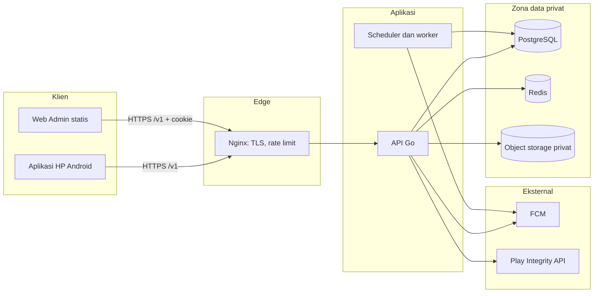
```mermaid
flowchart LR
    subgraph Klien
        M["Aplikasi HP Android"]
        W["Web Admin statis"]
    end
    subgraph Edge
        N["Nginx: TLS, rate limit"]
    end
    subgraph Aplikasi
        A["API Go"]
        J["Scheduler dan worker"]
    end
    subgraph Data["Zona data privat"]
        P[("PostgreSQL")]
        R[("Redis")]
        S[("Object storage privat")]
    end
    subgraph Eksternal
        F["FCM"]
        G["Play Integrity API"]
    end
    M -->|"HTTPS /v1"| N
    W -->|"HTTPS /v1 + cookie"| N
    N --> A
    A --> P
    A --> R
    A --> S
    A --> F
    A --> G
    J --> P
    J --> F
```

### F2. Perjalanan Satu Request di API
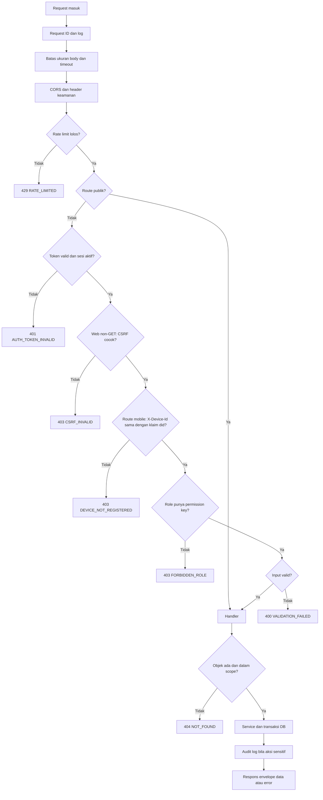
```mermaid
flowchart TD
    A["Request masuk"] --> B["Request ID dan log"]
    B --> C["Batas ukuran body dan timeout"]
    C --> D["CORS dan header keamanan"]
    D --> E{"Rate limit lolos?"}
    E -- Tidak --> E1["429 RATE_LIMITED"]
    E -- Ya --> F{"Route publik?"}
    F -- Ya --> L["Handler"]
    F -- Tidak --> G{"Token valid dan sesi aktif?"}
    G -- Tidak --> G1["401 AUTH_TOKEN_INVALID"]
    G -- Ya --> H{"Web non-GET: CSRF cocok?"}
    H -- Tidak --> H1["403 CSRF_INVALID"]
    H -- Ya --> I{"Route mobile: X-Device-Id sama dengan klaim did?"}
    I -- Tidak --> I1["403 DEVICE_NOT_REGISTERED"]
    I -- Ya --> J{"Role punya permission key?"}
    J -- Tidak --> J1["403 FORBIDDEN_ROLE"]
    J -- Ya --> K{"Input valid?"}
    K -- Tidak --> K1["400 VALIDATION_FAILED"]
    K -- Ya --> L
    L --> M{"Objek ada dan dalam scope?"}
    M -- Tidak --> M1["404 NOT_FOUND"]
    M -- Ya --> N["Service dan transaksi DB"]
    N --> O["Audit log bila aksi sensitif"]
    O --> P["Respons envelope data atau error"]
```

### F3. Pembuatan Akun & Aktivasi
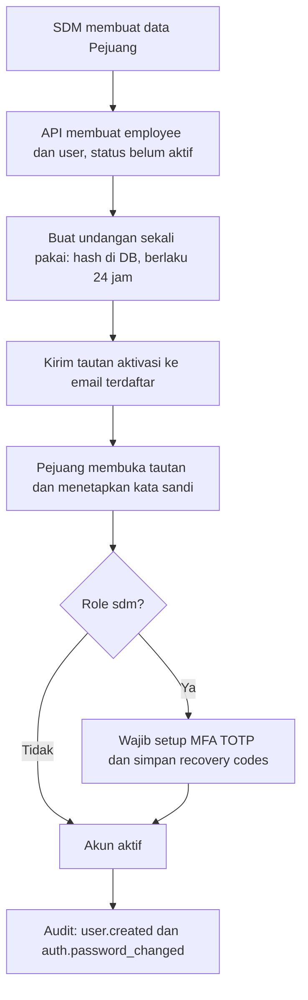
```mermaid
flowchart TD
    A["SDM membuat data Pejuang"] --> B["API membuat employee dan user, status belum aktif"]
    B --> C["Buat undangan sekali pakai: hash di DB, berlaku 24 jam"]
    C --> D["Kirim tautan aktivasi ke email terdaftar"]
    D --> E["Pejuang membuka tautan dan menetapkan kata sandi"]
    E --> F{"Role sdm?"}
    F -- Ya --> G["Wajib setup MFA TOTP dan simpan recovery codes"]
    F -- Tidak --> H["Akun aktif"]
    G --> H
    H --> I["Audit: user.created dan auth.password_changed"]
```

### F4. Login Web Admin
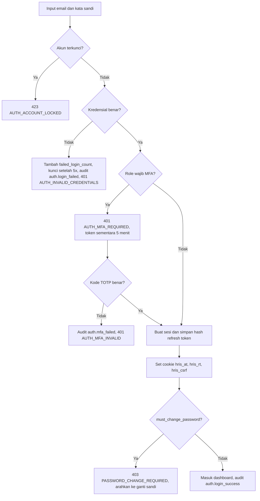
```mermaid
flowchart TD
    A["Input email dan kata sandi"] --> B{"Akun terkunci?"}
    B -- Ya --> B1["423 AUTH_ACCOUNT_LOCKED"]
    B -- Tidak --> C{"Kredensial benar?"}
    C -- Tidak --> C1["Tambah failed_login_count, kunci setelah 5x, audit auth.login_failed, 401 AUTH_INVALID_CREDENTIALS"]
    C -- Ya --> D{"Role wajib MFA?"}
    D -- Ya --> E["401 AUTH_MFA_REQUIRED, token sementara 5 menit"]
    E --> F{"Kode TOTP benar?"}
    F -- Tidak --> F1["Audit auth.mfa_failed, 401 AUTH_MFA_INVALID"]
    F -- Ya --> G["Buat sesi dan simpan hash refresh token"]
    D -- Tidak --> G
    G --> H["Set cookie hris_at, hris_rt, hris_csrf"]
    H --> I{"must_change_password?"}
    I -- Ya --> J["403 PASSWORD_CHANGE_REQUIRED, arahkan ke ganti sandi"]
    I -- Tidak --> K["Masuk dashboard, audit auth.login_success"]
```

### F5. Login Mobile & Device Binding
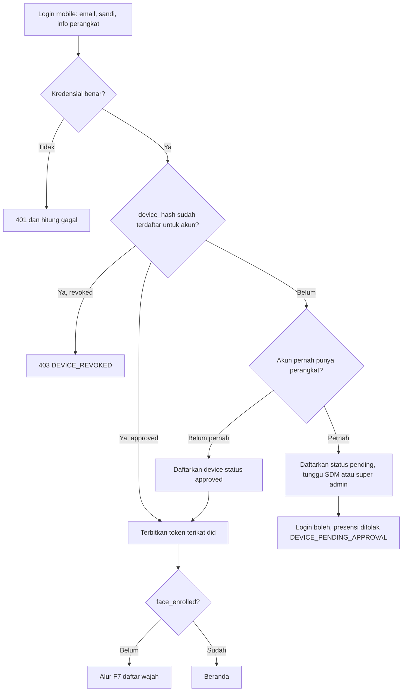
```mermaid
flowchart TD
    A["Login mobile: email, sandi, info perangkat"] --> B{"Kredensial benar?"}
    B -- Tidak --> B1["401 dan hitung gagal"]
    B -- Ya --> C{"device_hash sudah terdaftar untuk akun?"}
    C -- "Ya, revoked" --> X["403 DEVICE_REVOKED"]
    C -- "Ya, approved" --> H["Terbitkan token terikat did"]
    C -- Belum --> D{"Akun pernah punya perangkat?"}
    D -- Belum pernah --> E["Daftarkan device status approved"]
    D -- Pernah --> F["Daftarkan status pending, tunggu SDM atau super admin"]
    E --> H
    F --> G["Login boleh, presensi ditolak DEVICE_PENDING_APPROVAL"]
    H --> I{"face_enrolled?"}
    I -- Belum --> J["Alur F7 daftar wajah"]
    I -- Sudah --> K["Beranda"]
```

### F6. Rotasi Refresh Token & Deteksi Pencurian
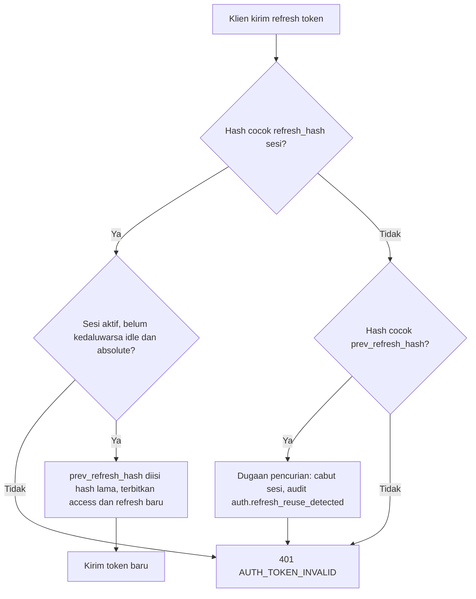
```mermaid
flowchart TD
    A["Klien kirim refresh token"] --> B{"Hash cocok refresh_hash sesi?"}
    B -- Ya --> C{"Sesi aktif, belum kedaluwarsa idle dan absolute?"}
    C -- Tidak --> X["401 AUTH_TOKEN_INVALID"]
    C -- Ya --> D["prev_refresh_hash diisi hash lama, terbitkan access dan refresh baru"]
    D --> E["Kirim token baru"]
    B -- Tidak --> F{"Hash cocok prev_refresh_hash?"}
    F -- Ya --> G["Dugaan pencurian: cabut sesi, audit auth.refresh_reuse_detected"]
    G --> X
    F -- Tidak --> X
```

### F7. Pendaftaran Wajah
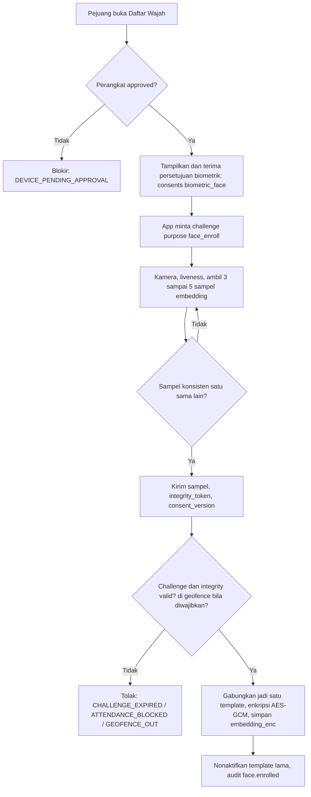
```mermaid
flowchart TD
    A["Pejuang buka Daftar Wajah"] --> B{"Perangkat approved?"}
    B -- Tidak --> X["Blokir: DEVICE_PENDING_APPROVAL"]
    B -- Ya --> C["Tampilkan dan terima persetujuan biometrik: consents biometric_face"]
    C --> D["App minta challenge purpose face_enroll"]
    D --> E["Kamera, liveness, ambil 3 sampai 5 sampel embedding"]
    E --> F{"Sampel konsisten satu sama lain?"}
    F -- Tidak --> E
    F -- Ya --> G["Kirim sampel, integrity_token, consent_version"]
    G --> H{"Challenge dan integrity valid? di geofence bila diwajibkan?"}
    H -- Tidak --> X2["Tolak: CHALLENGE_EXPIRED / ATTENDANCE_BLOCKED / GEOFENCE_OUT"]
    H -- Ya --> I["Gabungkan jadi satu template, enkripsi AES-GCM, simpan embedding_enc"]
    I --> J["Nonaktifkan template lama, audit face.enrolled"]
```

### F8. Presensi: Urutan Interaksi (Challenge–Response)
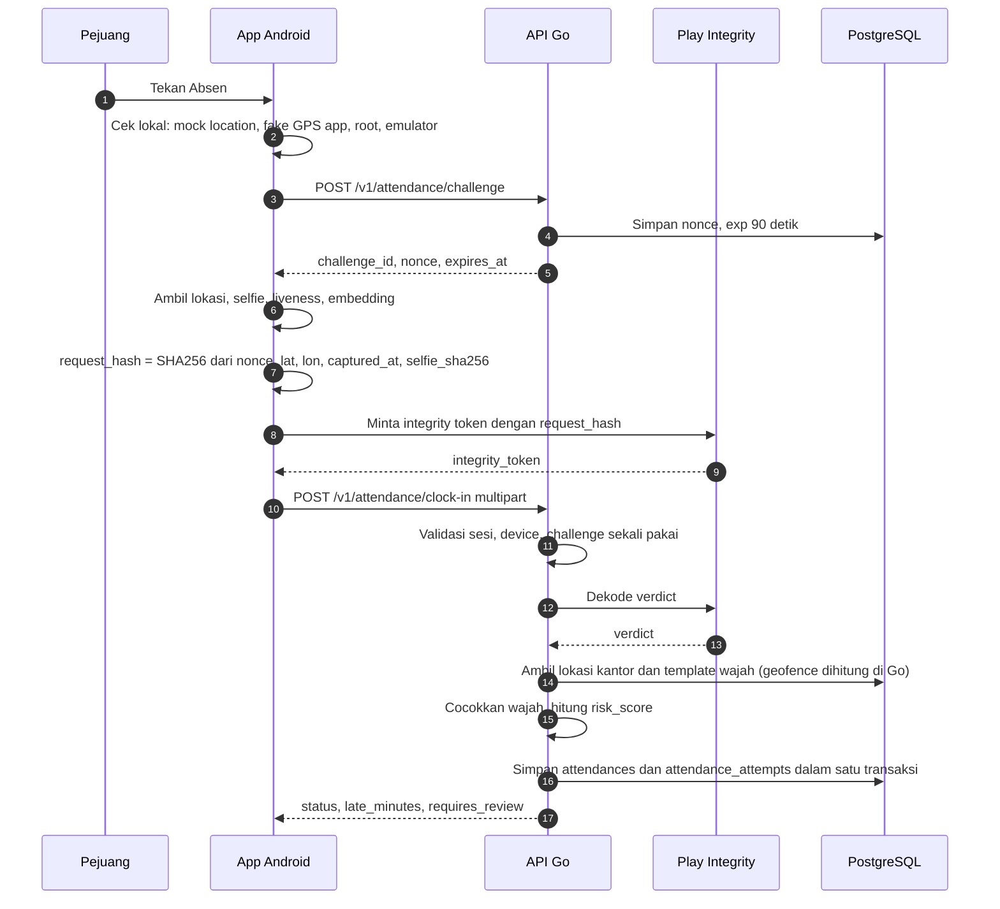
```mermaid
sequenceDiagram
    autonumber
    participant U as Pejuang
    participant A as App Android
    participant S as API Go
    participant G as Play Integrity
    participant D as PostgreSQL
    U->>A: Tekan Absen
    A->>A: Cek lokal: mock location, fake GPS app, root, emulator
    A->>S: POST /v1/attendance/challenge
    S->>D: Simpan nonce, exp 90 detik
    S-->>A: challenge_id, nonce, expires_at
    A->>A: Ambil lokasi, selfie, liveness, embedding
    A->>A: request_hash = SHA256 dari nonce, lat, lon, captured_at, selfie_sha256
    A->>G: Minta integrity token dengan request_hash
    G-->>A: integrity_token
    A->>S: POST /v1/attendance/clock-in multipart
    S->>S: Validasi sesi, device, challenge sekali pakai
    S->>G: Dekode verdict
    G-->>S: verdict
    S->>D: Ambil lokasi kantor dan template wajah (geofence dihitung di Go)
    S->>S: Cocokkan wajah, hitung risk_score
    S->>D: Simpan attendances dan attendance_attempts dalam satu transaksi
    S-->>A: status, late_minutes, requires_review
```

### F9. Presensi: Keputusan di Server
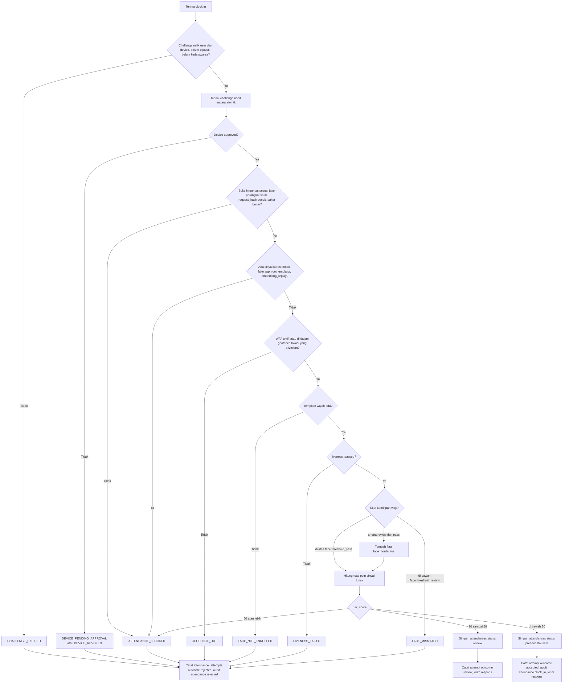
```mermaid
flowchart TD
    A["Terima clock-in"] --> B{"Challenge milik user dan device, belum dipakai, belum kedaluwarsa?"}
    B -- Tidak --> R1["CHALLENGE_EXPIRED"]
    B -- Ya --> C["Tandai challenge used secara atomik"]
    C --> D{"Device approved?"}
    D -- Tidak --> R2["DEVICE_PENDING_APPROVAL atau DEVICE_REVOKED"]
    D -- Ya --> E{"Bukti integritas sesuai jalur perangkat valid, request_hash cocok, paket benar?"}
    E -- Tidak --> R3["ATTENDANCE_BLOCKED"]
    E -- Ya --> F{"Ada sinyal keras: mock, fake app, root, emulator, embedding_replay?"}
    F -- Ya --> R3
    F -- Tidak --> G{"WFA aktif, atau di dalam geofence lokasi yang diizinkan?"}
    G -- Tidak --> R4["GEOFENCE_OUT"]
    G -- Ya --> H{"Template wajah ada?"}
    H -- Tidak --> R5["FACE_NOT_ENROLLED"]
    H -- Ya --> I{"liveness_passed?"}
    I -- Tidak --> R6["LIVENESS_FAILED"]
    I -- Ya --> J{"Skor kemiripan wajah"}
    J -- "di bawah face.threshold_review" --> R7["FACE_MISMATCH"]
    J -- "antara review dan pass" --> K["Tambah flag face_borderline"]
    J -- "di atas face.threshold_pass" --> L["Hitung total poin sinyal lunak"]
    K --> L
    L --> M{"risk_score"}
    M -- "60 atau lebih" --> R3
    M -- "30 sampai 59" --> N["Simpan attendances status review"]
    M -- "di bawah 30" --> O["Simpan attendances status present atau late"]
    R1 & R2 & R3 & R4 & R5 & R6 & R7 --> Z["Catat attendance_attempts outcome rejected, audit attendance.rejected"]
    N --> Y["Catat attempt outcome review, kirim respons"]
    O --> Y2["Catat attempt outcome accepted, audit attendance.clock_in, kirim respons"]
```

### F10. Absen Pulang
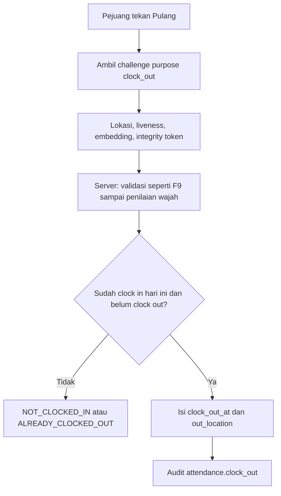
```mermaid
flowchart TD
    A["Pejuang tekan Pulang"] --> B["Ambil challenge purpose clock_out"]
    B --> C["Lokasi, liveness, embedding, integrity token"]
    C --> D["Server: validasi seperti F9 sampai penilaian wajah"]
    D --> E{"Sudah clock in hari ini dan belum clock out?"}
    E -- Tidak --> X["NOT_CLOCKED_IN atau ALREADY_CLOCKED_OUT"]
    E -- Ya --> F["Isi clock_out_at dan out_location"]
    F --> G["Audit attendance.clock_out"]
```

### F11. Review Absen Berisiko oleh SDM
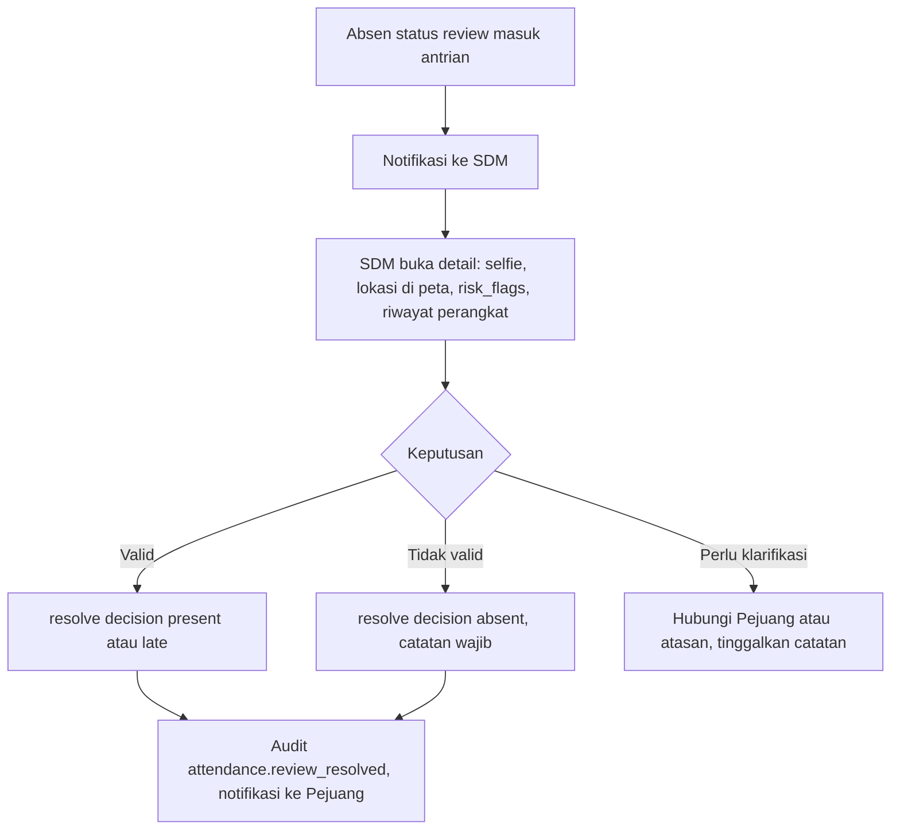
```mermaid
flowchart TD
    A["Absen status review masuk antrian"] --> B["Notifikasi ke SDM"]
    B --> C["SDM buka detail: selfie, lokasi di peta, risk_flags, riwayat perangkat"]
    C --> D{"Keputusan"}
    D -- "Valid" --> E["resolve decision present atau late"]
    D -- "Tidak valid" --> F["resolve decision absent, catatan wajib"]
    D -- "Perlu klarifikasi" --> G["Hubungi Pejuang atau atasan, tinggalkan catatan"]
    E --> H["Audit attendance.review_resolved, notifikasi ke Pejuang"]
    F --> H
```
`present` menghapus keterlambatan. `late` hanya untuk absen yang memang terlambat. Peninjau tidak bisa memutuskan absennya sendiri (`CONFLICT_SELF_ACTION`). Absen yang diputuskan `absent` tidak bisa diberi absen pulang lagi.

### F12. Mesin Approval Generik
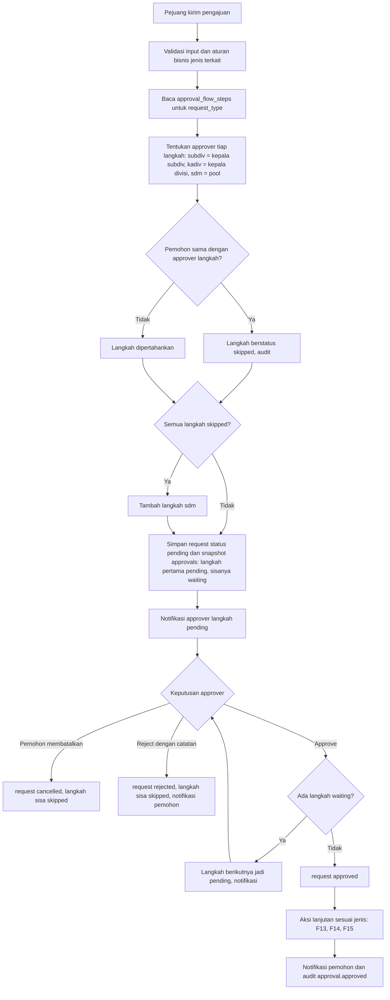
```mermaid
flowchart TD
    A["Pejuang kirim pengajuan"] --> B["Validasi input dan aturan bisnis jenis terkait"]
    B --> C["Baca approval_flow_steps untuk request_type"]
    C --> D["Tentukan approver tiap langkah: subdiv = kepala subdiv, kadiv = kepala divisi, sdm = pool"]
    D --> E{"Pemohon sama dengan approver langkah?"}
    E -- Ya --> E1["Langkah berstatus skipped, audit"]
    E -- Tidak --> F["Langkah dipertahankan"]
    E1 --> G
    F --> G{"Semua langkah skipped?"}
    G -- Ya --> G1["Tambah langkah sdm"]
    G -- Tidak --> H
    G1 --> H["Simpan request status pending dan snapshot approvals: langkah pertama pending, sisanya waiting"]
    H --> I["Notifikasi approver langkah pending"]
    I --> J{"Keputusan approver"}
    J -- "Pemohon membatalkan" --> C1["request cancelled, langkah sisa skipped"]
    J -- "Reject dengan catatan" --> K["request rejected, langkah sisa skipped, notifikasi pemohon"]
    J -- Approve --> L{"Ada langkah waiting?"}
    L -- Ya --> M["Langkah berikutnya jadi pending, notifikasi"]
    M --> J
    L -- Tidak --> N["request approved"]
    N --> O["Aksi lanjutan sesuai jenis: F13, F14, F15"]
    O --> P["Notifikasi pemohon dan audit approval.approved"]
```
Validasi saat approver memutuskan: identitas = `assigned_employee_id` (atau role `sdm` untuk pool), bukan pemohon, langkah berstatus `pending`, dan aksi idempoten (klik ganda tidak menggandakan efek).

### F13. Cuti & Izin
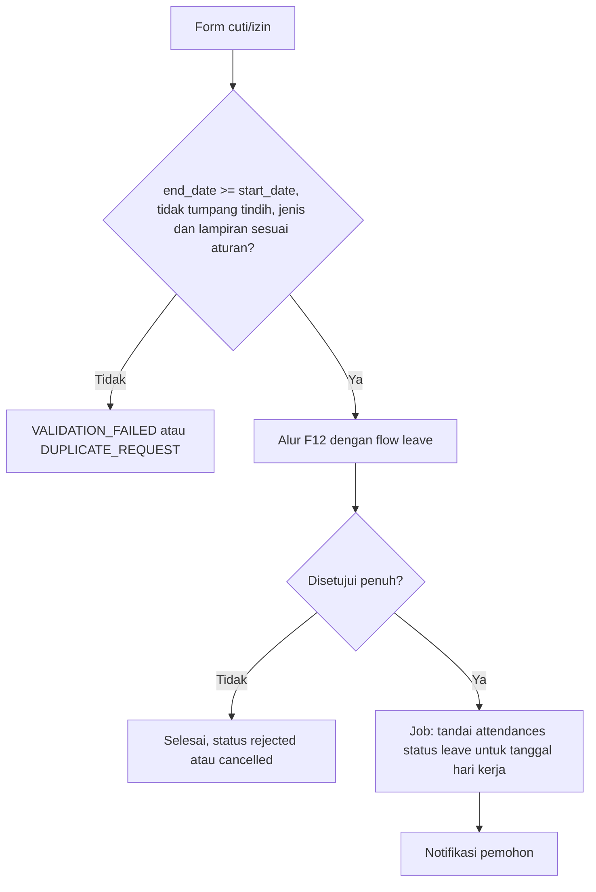
```mermaid
flowchart TD
    A["Form cuti/izin"] --> B{"end_date >= start_date, tidak tumpang tindih, jenis dan lampiran sesuai aturan?"}
    B -- Tidak --> B1["VALIDATION_FAILED atau DUPLICATE_REQUEST"]
    B -- Ya --> C["Alur F12 dengan flow leave"]
    C --> D{"Disetujui penuh?"}
    D -- Tidak --> E["Selesai, status rejected atau cancelled"]
    D -- Ya --> F["Job: tandai attendances status leave untuk tanggal hari kerja"]
    F --> G["Notifikasi pemohon"]
```

### F14. Kasbon
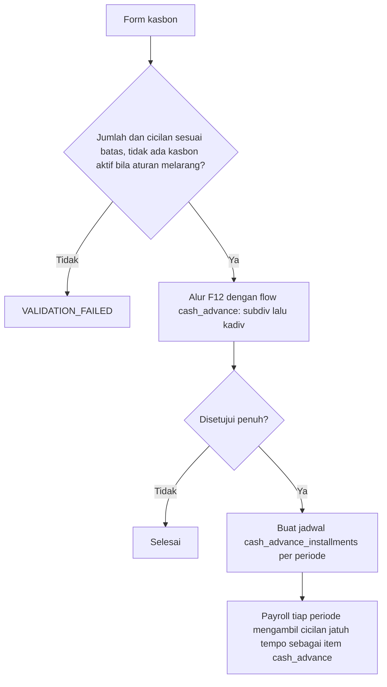
```mermaid
flowchart TD
    A["Form kasbon"] --> B{"Jumlah dan cicilan sesuai batas, tidak ada kasbon aktif bila aturan melarang?"}
    B -- Tidak --> B1["VALIDATION_FAILED"]
    B -- Ya --> C["Alur F12 dengan flow cash_advance: subdiv lalu kadiv"]
    C --> D{"Disetujui penuh?"}
    D -- Tidak --> E["Selesai"]
    D -- Ya --> F["Buat jadwal cash_advance_installments per periode"]
    F --> G["Payroll tiap periode mengambil cicilan jatuh tempo sebagai item cash_advance"]
```

### F15. Mutasi
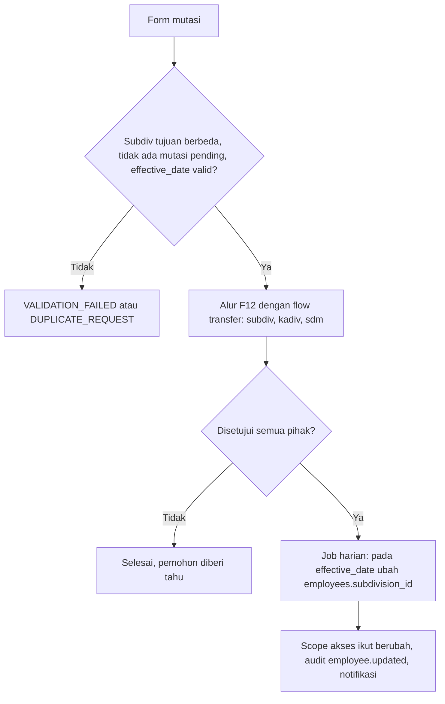
```mermaid
flowchart TD
    A["Form mutasi"] --> B{"Subdiv tujuan berbeda, tidak ada mutasi pending, effective_date valid?"}
    B -- Tidak --> B1["VALIDATION_FAILED atau DUPLICATE_REQUEST"]
    B -- Ya --> C["Alur F12 dengan flow transfer: subdiv, kadiv, sdm"]
    C --> D{"Disetujui semua pihak?"}
    D -- Tidak --> E["Selesai, pemohon diberi tahu"]
    D -- Ya --> F["Job harian: pada effective_date ubah employees.subdivision_id"]
    F --> G["Scope akses ikut berubah, audit employee.updated, notifikasi"]
```

### F16. Ganti Perangkat & Perangkat Hilang
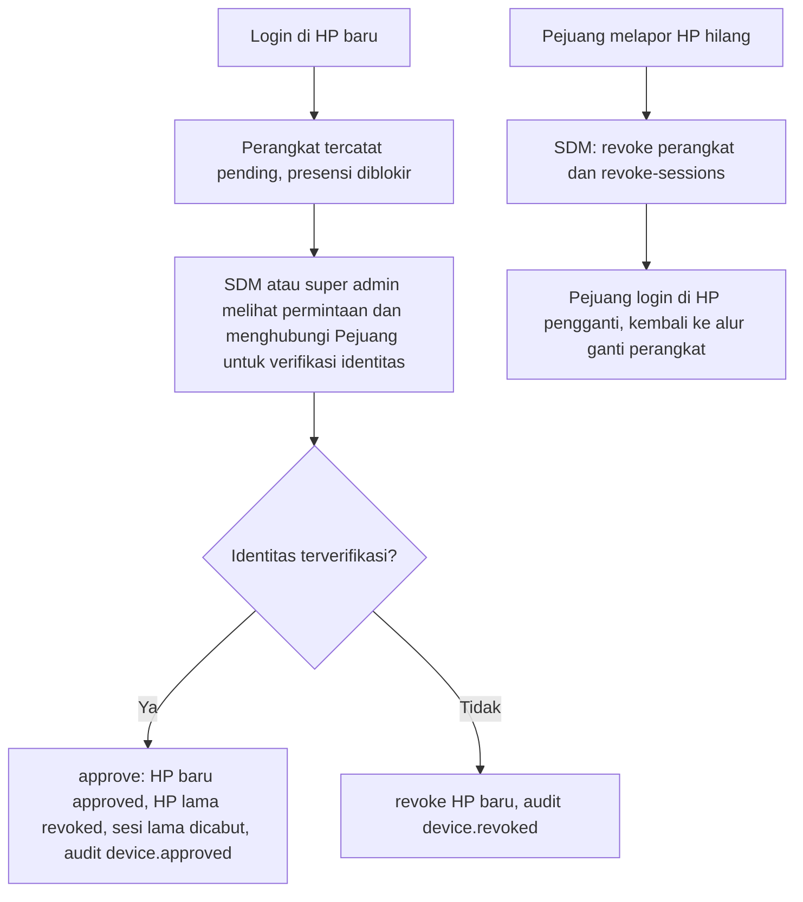
```mermaid
flowchart TD
    A["Login di HP baru"] --> B["Perangkat tercatat pending, presensi diblokir"]
    B --> C["SDM atau super admin melihat permintaan dan menghubungi Pejuang untuk verifikasi identitas"]
    C --> D{"Identitas terverifikasi?"}
    D -- Ya --> E["approve: HP baru approved, HP lama revoked, sesi lama dicabut, audit device.approved"]
    D -- Tidak --> F["revoke HP baru, audit device.revoked"]
    G["Pejuang melapor HP hilang"] --> H["SDM: revoke perangkat dan revoke-sessions"]
    H --> I["Pejuang login di HP pengganti, kembali ke alur ganti perangkat"]
```

### F17. Payroll Bulanan (Maker–Checker)
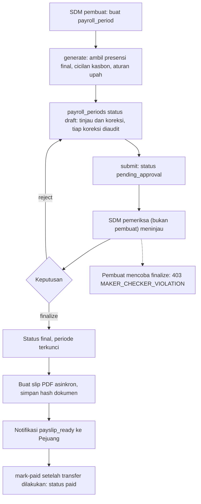
```mermaid
flowchart TD
    A["SDM pembuat: buat payroll_period"] --> B["generate: ambil presensi final, cicilan kasbon, aturan upah"]
    B --> C["payroll_periods status draft: tinjau dan koreksi, tiap koreksi diaudit"]
    C --> D["submit: status pending_approval"]
    D --> E["SDM pemeriksa (bukan pembuat) meninjau"]
    E --> F{"Keputusan"}
    F -- reject --> C
    F -- finalize --> G["Status final, periode terkunci"]
    G --> H["Buat slip PDF asinkron, simpan hash dokumen"]
    H --> I["Notifikasi payslip_ready ke Pejuang"]
    I --> J["mark-paid setelah transfer dilakukan: status paid"]
    E -.-> M["Pembuat mencoba finalize: 403 MAKER_CHECKER_VIOLATION"]
```

### F18. Pengumuman Pop-up & Banner
**Timer baca (D27):** tombol "Sudah baca" di aplikasi nonaktif dan menampilkan hitung mundur selama `min_read_seconds` (diatur SDM per pengumuman, 0 sampai 120 detik, default 10). Notifikasi memakai `notification.min_read_seconds` (default 5). Timer di app hanya tampilan: saat isi dibuka, app memanggil `/open` dan server mencatat `opened_at` sekali saja; `/read` yang datang lebih cepat dari batas ditolak `422 READ_TOO_SOON`.

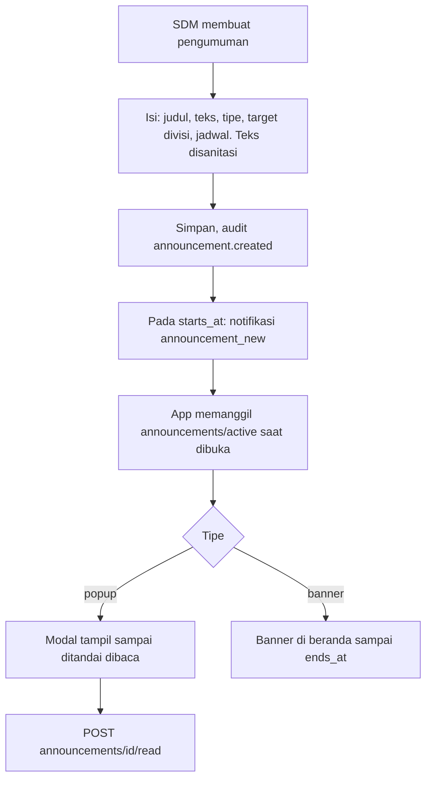
```mermaid
flowchart TD
    A["SDM membuat pengumuman"] --> B["Isi: judul, teks, tipe, target divisi, jadwal. Teks disanitasi"]
    B --> C["Simpan, audit announcement.created"]
    C --> D["Pada starts_at: notifikasi announcement_new"]
    D --> E["App memanggil announcements/active saat dibuka"]
    E --> F{"Tipe"}
    F -- popup --> G["Modal tampil sampai ditandai dibaca"]
    F -- banner --> H["Banner di beranda sampai ends_at"]
    G --> I["POST announcements/id/read"]
```

### F19. Surat Peringatan
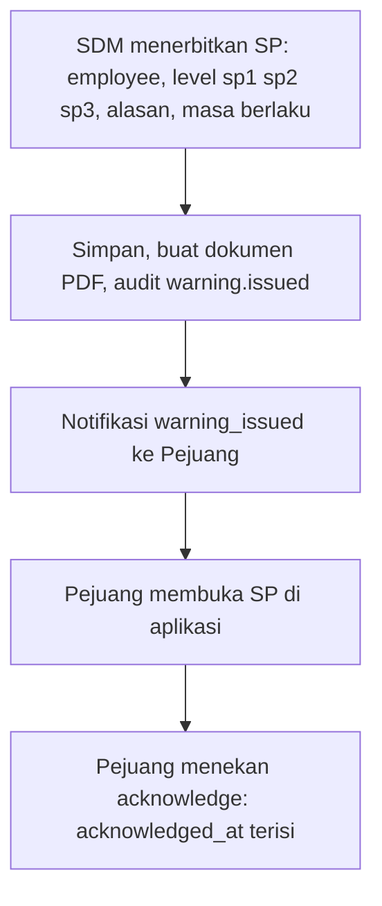
```mermaid
flowchart TD
    A["SDM menerbitkan SP: employee, level sp1 sp2 sp3, alasan, masa berlaku"] --> B["Simpan, buat dokumen PDF, audit warning.issued"]
    B --> C["Notifikasi warning_issued ke Pejuang"]
    C --> D["Pejuang membuka SP di aplikasi"]
    D --> E["Pejuang menekan acknowledge: acknowledged_at terisi"]
```

### F20. Pejuang Keluar (Offboarding)
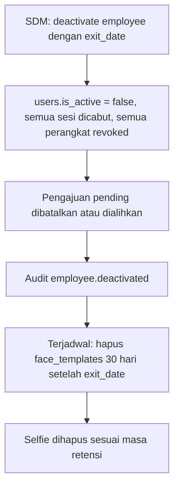
```mermaid
flowchart TD
    A["SDM: deactivate employee dengan exit_date"] --> B["users.is_active = false, semua sesi dicabut, semua perangkat revoked"]
    B --> C["Pengajuan pending dibatalkan atau dialihkan"]
    C --> D["Audit employee.deactivated"]
    D --> E["Terjadwal: hapus face_templates 30 hari setelah exit_date"]
    E --> F["Selfie dihapus sesuai masa retensi"]
```

### F21. Alur Pengembangan Satu Fitur (Contract-First)
```mermaid
flowchart TD
    A["Ambil item dari checklist"] --> B["Tulis atau ubah openapi.yaml"]
    B --> C["Review kontrak: key, enum, error code sesuai master dokumen"]
    C --> D["Migrasi DB maju-saja bila perlu"]
    D --> E["Tulis query sqlc, service, handler, middleware permission"]
    E --> F["Tes: unit, integrasi DB, tes permission dan scope"]
    F --> G["Generate klien TypeScript dan Kotlin"]
    G --> H["Bangun UI web atau mobile memakai tipe hasil generate"]
    H --> I["Checklist keamanan PR Lampiran C"]
    I --> J["Pull request dan review"]
    J --> K["CI lulus lalu merge ke develop"]
```

### F22. Pipeline CI/CD
```mermaid
flowchart LR
    A["Push / PR"] --> B["Lint: golangci-lint, eslint, spectral"]
    B --> C["Scan rahasia: gitleaks"]
    C --> D["Tes unit dan integrasi"]
    D --> E["Keamanan: govulncheck, gosec, npm audit"]
    E --> F["Build image"]
    F --> G["Scan image: trivy"]
    G --> H{"Branch?"}
    H -- develop --> I["Deploy staging"]
    H -- main --> J["Persetujuan manual"]
    J --> K["Deploy produksi + migrasi"]
    K --> L["Smoke test dan pantau"]
```

### F23. Alur Demo Jumat (6 Nov 2026)
```mermaid
flowchart LR
    A["Login SDM"] --> B["Dashboard grafik"]
    B --> C["Tambah Pejuang baru"]
    C --> D["Grafik berubah"]
    D --> E["Buat pengumuman"]
    E --> F["Rekap presensi"]
    F --> G["Laporan upah"]
    G --> H["Slide arsitektur dan roadmap"]
```

---

## 9. State Machine

### 9.1 Pengajuan (`request_status`)
```mermaid
stateDiagram-v2
    [*] --> pending
    pending --> approved: semua langkah approve
    pending --> rejected: ada langkah reject
    pending --> cancelled: pemohon membatalkan
    approved --> [*]
    rejected --> [*]
    cancelled --> [*]
```

### 9.2 Langkah Approval (`approval_step_status`)
```mermaid
stateDiagram-v2
    [*] --> waiting
    waiting --> pending: langkah sebelumnya approve
    waiting --> skipped: pemohon sama dengan approver, atau request ditutup
    pending --> approved
    pending --> rejected
    pending --> skipped: request dibatalkan
```

### 9.3 Perangkat (`device_status`)
```mermaid
stateDiagram-v2
    [*] --> pending: perangkat tambahan
    [*] --> approved: perangkat pertama
    pending --> approved: SDM approve
    pending --> revoked: SDM tolak
    approved --> revoked: hilang, ganti, atau keluar kerja
```

### 9.4 Presensi (`att_status`)
```mermaid
stateDiagram-v2
    [*] --> present: tepat waktu, skor rendah
    [*] --> late: lewat toleransi
    [*] --> review: skor 30 sampai 59
    [*] --> leave: cuti disetujui
    [*] --> absent: job malam, tanpa catatan
    review --> present: SDM valid
    review --> late: SDM valid
    review --> absent: SDM tidak valid
```

### 9.5 Periode Payroll (`payroll_status`)
```mermaid
stateDiagram-v2
    [*] --> draft
    draft --> pending_approval: submit
    pending_approval --> draft: reject
    pending_approval --> final: finalize oleh orang lain
    final --> paid: mark-paid
```

### 9.6 Sesi
```mermaid
stateDiagram-v2
    [*] --> active: login berhasil
    active --> active: refresh dan rotasi
    active --> expired: idle atau absolute habis
    active --> revoked: logout, reuse terdeteksi, admin mencabut
```

---

## 10. Frontend

### 10.1 Web Admin
**Stack:** Next.js (App Router, `output: 'export'`), TypeScript strict, Refine + Ant Design, Recharts. Pilihan UI kit boleh diganti tanpa mengubah kontrak API.

```
web/
├─ src/
│  ├─ app/                 # rute
│  ├─ providers/           # authProvider, dataProvider, accessControlProvider
│  ├─ api/                 # klien hasil generate dari openapi.yaml (jangan edit manual)
│  ├─ constants/           # enum, role, permission, error code (hasil generate)
│  ├─ features/            # org, employees, attendance, payroll, approvals, announcements, ...
│  ├─ components/
│  └─ lib/                 # format tanggal WIB, uang, sanitasi
└─ next.config.js          # output: 'export'
```

**Aturan:**
1. Tipe dan konstanta dari hasil generate; tidak ada string enum diketik manual.
2. Auth lewat cookie; `fetch` dengan `credentials: 'include'` dan header `X-CSRF-Token`. Tidak ada token di storage JS.
3. Pada 401: coba `refresh` satu kali, bila gagal arahkan ke login.
4. Menu dan tombol disembunyikan berdasar `permissions` dari `/v1/me` (hanya kenyamanan).
5. Tabel selalu paginasi di server; filter dikirim sebagai query param resmi.
6. Pemetaan `error.code` → pesan ramah; tampilkan `request_id` pada error tak terduga.
7. Isi pengumuman: teks murni atau hasil sanitasi; tanpa `dangerouslySetInnerHTML`.
8. Ekspor: netralkan formula injection.
9. Idle logout 30 menit; konfirmasi untuk aksi destruktif dan finalisasi payroll.
10. Karena export statis, **route guard di klien hanya UX**; penegakan di API.

**Halaman prioritas:** Login (+MFA), Dashboard, Master Data (Divisi, Subdiv, Pejuang, Lokasi, Shift), Presensi (Rekap, Review), Payroll, Pengajuan, Surat Peringatan, Pengumuman, Pengaturan.

**Gaya UI:** bersih dan padat informasi, satu warna aksen (hijau `#15803D`), font Inter, sidebar kiri, kartu sudut 8 px, mode terang dulu.

### 10.2 Mobile (Android)
**Stack:** Kotlin, Jetpack Compose, MVVM, Hilt, Retrofit/OkHttp (klien hasil generate), CameraX, ML Kit Face Detection, TFLite MobileFaceNet, Play Integrity, FusedLocationProvider, FCM. `minSdk 26`.

```
mobile/app/src/main/java/.../
├─ ui/            # layar Compose: home, attendance, requests, payslip, profile
├─ domain/        # use case
├─ data/          # repository, api (generate), local
├─ security/      # MockLocationDetector, RootDetector, EmulatorDetector, IntegrityClient, SecureStore
├─ face/          # liveness, embedding, kualitas gambar
└─ core/          # error mapper, konstanta (generate)
```

**Aturan:**
1. Token di Keystore/EncryptedSharedPreferences; access token di memori.
2. Semua pemanggilan lewat klien generate; konstanta enum dan error code dari generate.
3. Presensi wajib online (waktu server yang berlaku); bila offline tampilkan pesan jelas, jangan antre diam-diam.
4. Deteksi lokal (mock, root, emulator) dijalankan **sebelum** meminta challenge agar pengguna cepat tahu.
5. `FLAG_SECURE` pada slip dan profil; `allowBackup=false`; log rilis tanpa data pribadi.
6. Uji di minimal 3 HP Android 10 kelas bawah sebelum rilis.

**Prinsip "mudah dipakai":**
- Beranda: satu tombol Absen besar dan status hari ini.
- Absen maksimal 3 ketukan; indikator "Anda berada di area kantor" sebelum memotret.
- Wajah gagal: pesan spesifik dan tombol ulang (cahaya kurang, wajah tidak terlihat), maksimal 3 kali; setelahnya tawarkan "kirim untuk ditinjau SDM".
- Pengajuan menampilkan **timeline approval** (siapa, status, catatan).
- Bahasa sederhana, tombol besar, kontras tinggi, animasi minimal untuk HP lama.

---

## 11. Backend

### 11.1 Struktur
```
backend/
├─ cmd/api/main.go
├─ internal/
│  ├─ auth/          # login, JWT, sesi, MFA, invite
│  ├─ permission/    # peta role → permission key (satu file, diuji)
│  ├─ org/ employee/ device/ face/
│  ├─ attendance/    # challenge, geofence, risk, integrity
│  ├─ approval/      # mesin approval generik
│  ├─ leave/ cashadvance/ transfer/
│  ├─ payroll/ payslip/
│  ├─ announcement/ warning/ notification/
│  ├─ report/ dashboard/ audit/
│  ├─ jobs/          # scheduler
│  └─ platform/      # db, redis, config, logger, storage, crypto, fcm, integrity
├─ migrations/
├─ queries/          # sqlc
└─ api/openapi.yaml
```
Lapisan: **handler** (HTTP, validasi) → **service** (aturan bisnis, otorisasi scope, transaksi) → **repository** (sqlc). Handler tidak boleh mengakses DB langsung.

### 11.2 Urutan Middleware
Request ID → recover → logger → batas body/timeout → CORS & header keamanan → rate limit → autentikasi → CSRF (web) → device check (mobile) → permission → validasi → handler. Rincian di F2.

### 11.3 Job Terjadwal
| Job | Jadwal | Fungsi |
|---|---|---|
| `mark_absent` | harian malam (WIB) | Tandai `absent` untuk hari kerja tanpa presensi/cuti/libur |
| `apply_leave_to_attendance` | saat approved + harian | Isi `leave` pada tanggal cuti |
| `apply_effective_transfers` | harian | Terapkan mutasi pada `effective_date` |
| `expire_challenges` | tiap menit | Bersihkan challenge kedaluwarsa |
| `purge_selfies` | harian | Hapus selfie melewati retensi |
| `purge_biometrics` | harian | Hapus template wajah 30 hari setelah keluar kerja |
| `generate_payslip_pdf` | antrean | Buat slip setelah finalisasi |
| `send_notifications` | antrean | Kirim FCM |

### 11.4 Konfigurasi & Observabilitas
- Konfigurasi dari environment (Lampiran B); gagal start bila secret wajib kosong.
- Log JSON terstruktur (`slog`) dengan `request_id`, tanpa PII.
- Metrik (Prometheus): latensi per endpoint, jumlah `review`/`rejected`, login gagal, antrean job.
- Endpoint `/healthz` (liveness) dan `/readyz` (cek DB dan Redis).

### 11.5 Perhitungan Upah
**Aturan upah diatur SDM lewat panel, bukan ditulis di kode (D29).**
- Nilainya berupa parameter: potongan telat (per kejadian atau per menit), potongan alpha (pembagi hari kerja atau nominal), lembur (tarif per jam atau kelipatan upah), dan perlakuan lembur untuk jam fleksibel.
- Setiap perubahan membuat versi baru di `payroll_rule_versions` (`effective_from`, `params`, `created_by`), memakai `payroll:manage`, dan tercatat di audit (`payroll.rules_changed`).
- Saat generate, `payroll_periods` menyimpan versi aturan yang dipakai, sehingga periode lama tidak berubah saat aturan diperbarui.
- Potongan atau tambahan di luar parameter dicatat SDM sebagai item manual per Pejuang.
- Rumus bebas yang diketik pengguna tidak didukung, karena lebih rawan salah hitung dan menjalankan masukan pengguna sebagai logika. Jenis perhitungan yang benar-benar baru tetap perlu perubahan kode.

**Cutoff jam kerja (D31).** Ada dua batas, keduanya diatur SDM dan ikut berversi di `payroll_rule_versions`:

- **Cutoff periode** (`period_cutoff_day`, 1 sampai 28, atau akhir bulan). **Nilai awal: 25**, jadi periode Januari berjalan 26 Desember sampai 25 Januari. Periode diberi label bulan berakhirnya. Nilai ini mengasumsikan upah dibayar di akhir bulan; bila dibayar lebih awal, SDM perlu memajukan cutoff, mis. ke tanggal 20.
- **Cutoff harian** (`day_cutoff_time`, jam WIB). **Nilai awal: 04:00**, untuk sementara tertulis di kode sampai pengaturan SDM dibuat di Fase 5. Shift yang memang dimulai sebelum cutoff (mis. 03.00) tetap masuk hari yang sama, dan absen sampai 2 jam sebelum shift tengah malam masuk ke tanggal shift itu. Absen masuk sebelum jam ini masuk ke `work_date` hari sebelumnya, sehingga shift malam dan dinas larut tidak terbelah dua tanggal.

Aturan penghitungan:
- Rekap dan payroll menghitung dari rentang `start_date` sampai `end_date` periode, bukan bulan kalender.
- Rentang disimpan saat periode dibuat. Periode harus bersambung tanpa celah atau tumpang tindih, jadi perubahan cutoff baru berlaku di periode berikutnya.
- `worked_minutes` dihitung server dari absen masuk dan pulang.
- Absen tanpa absen pulang sampai cutoff harian berikutnya **tidak diberi jam kerja otomatis**. Shift malam yang berakhir setelah cutoff diberi batas 4 jam setelah jam pulang shift. `worked_minutes` tetap kosong dan SDM yang mengoreksinya.
- Periode tidak bisa di-submit selama masih ada absen `review` atau tanpa absen pulang.
- Setelah `finalized`, absen dalam rentangnya terkunci. Koreksi sesudahnya masuk sebagai item penyesuaian di periode berikutnya, dan tercatat di audit (`attendance.adjusted`).

Semua hitungan memakai `NUMERIC`/`decimal`, tidak pernah float.

---

## 12. Alur Pengembangan & Kualitas

### 12.1 Alur Kerja
Lihat F21 (contract-first) dan F22 (CI/CD). Branch: `main` (produksi), `develop` (staging), `feat/<modul>-<ringkas>`. Commit konvensional (`feat:`, `fix:`). Satu PR = satu item checklist. Minimal satu reviewer; branch `main` terproteksi.

### 12.2 Definition of Done (per fitur)
- [ ] `openapi.yaml` diperbarui dan lolos lint
- [ ] Key, enum, error code sesuai master dokumen (atau dokumen diperbarui di PR yang sama)
- [ ] Permission key dipasang di route dan dites untuk **tiap role** (diizinkan dan ditolak)
- [ ] Tes scope/IDOR: akses data di luar scope menghasilkan 404
- [ ] Aksi sensitif menulis `audit_logs`
- [ ] Tidak ada PII/rahasia di log
- [ ] Klien (web/mobile) memakai tipe hasil generate
- [ ] Lolos Lampiran C

### 12.3 Strategi Tes
| Tingkat | Alat | Fokus |
|---|---|---|
| Unit | `go test` | Skor risiko, hitung upah, aturan approval |
| Integrasi | PostgreSQL asli di CI (`internal/integration`) | Query, transaksi, hak akses role |
| Matriks permission | tes tabel role × endpoint | Deny by default |
| Kontrak | schemathesis/dredd terhadap `openapi.yaml` | Respons sesuai kontrak |
| E2E web | Playwright | Alur demo dan alur kritis |
| Mobile | instrumented test + HP nyata | Kamera, GPS, integrity |
| Beban | k6 | Lonjakan clock-in jam masuk |
| Keamanan | `govulncheck`, `gosec`, `npm audit`, trivy, uji serangan manual (fake GPS, foto, emulator, root, replay) | |

---

## 13. Roadmap & Checklist

### 13.1 Fase
| Fase | Fokus | Estimasi | Target |
|---|---|---|---|
| 0 | Demo web admin | 5 hari | **Jumat 6 Nov 2026** |
| 1 | Fondasi keamanan & produksi | 1-2 minggu | pertengahan Nov |
| 2 | Presensi (backend + web) | 3-4 minggu | Des 2026 |
| 3 | Aplikasi mobile (paralel fase 2) | 4-6 minggu | Des 2026 - Jan 2027 |
| 4 | Pengajuan & approval | 3 minggu | Jan 2027 |
| 5 | Payroll & SP | 3 minggu | Feb 2027 |
| 6 | Uji, pilot, rilis | 3-4 minggu | Mar 2027 |

Estimasi untuk tim kecil; sesuaikan setelah kapasitas tim jelas.

### 13.2 Fase 0 (Senin 2 - Jumat 6 Nov), dengan keamanan minimum
| Hari | Pekerjaan | Keamanan yang tetap dikerjakan |
|---|---|---|
| Senin | Repo, Docker Compose (Postgres+PostGIS, Redis), migrasi tabel inti, project Go + Next.js, login | argon2id, cookie HttpOnly, middleware permission, CORS terbatas, query sqlc |
| Selasa | CRUD Divisi, Subdiv, Pejuang | Validasi input, cek scope, audit dasar |
| Rabu | Dashboard grafik (org-chart) | Hanya role `sdm` |
| Kamis | Pengumuman, rekap presensi dummy, laporan upah sederhana | Sanitasi teks pengumuman |
| Jumat | Rapikan, latihan demo, rekaman cadangan | **Tanpa fitur baru**; gunakan data dummy, bukan data nyata |

**Ditunda ke Fase 1 (disebut jujur di presentasi):** MFA, rotasi refresh token penuh, audit log lengkap, rate limit lengkap, HTTPS produksi.

**Status: selesai.** Dikonfirmasi pemilik proyek lewat uji manual di server development (aaPanel, data dummy, HTTP, MFA dimatikan), termasuk alur demo F23 2x. Belum ada tes end-to-end otomatis.

### 13.3 Checklist Ringkas per Fase
**Fase 1: Fondasi**
- [x] Refresh token rotasi + deteksi reuse (tes integrasi)
- [x] MFA TOTP untuk `sdm` (tes integrasi; dikonfirmasi berjalan di server)
- [x] Aktivasi lewat undangan sekali pakai (tes integrasi; dikonfirmasi berjalan di server)
- [x] Rate limit + lockout (tes integrasi; memori, Redis menyusul)
- [x] `audit_logs` append-only (`REVOKE`) (tes integrasi sebagai `hris_app`)
- [x] Tes integrasi dengan PostgreSQL asli, dijalankan di CI (`backend/internal/integration`)
- [ ] OpenAPI + generate klien TS/Kotlin (TS selesai, Kotlin menyusul di Fase 3)
- [x] CI (lint, tes, gitleaks, govulncheck, trivy) (`.github/workflows/ci.yml`)
- [ ] Ditangguhkan (D21): staging HTTPS + backup + uji restore, dikerjakan menjelang Fase 6
- [x] Tiga user DB (`hris_app`, `hris_migrate`, `hris_ro`)

**Fase 2: Presensi**
- [x] Lokasi kantor + shift + hari libur
- [x] Device binding + persetujuan SDM atau super admin (D25, D32, D34)
- [x] Peta untuk mengatur area lokasi (D28)
- [ ] Challenge + verifikasi Play Integrity (jalur A)
- [ ] Key Attestation (jalur B), perangkat manual (jalur D), kiosk (jalur E); Huawei (jalur C) bila ada penggunanya
- [x] Izin WFA dan hybrid per Pejuang dan jam fleksibel, di API dan layar SDM
- [x] Penetapan izin massal per divisi atau subdiv, dan saring rekap per `work_mode`
- [ ] Pendaftaran wajah jarak jauh
- [x] Challenge, clock-in, clock-out, cutoff harian, dan `worked_minutes` (D31), masih tanpa verifikasi perangkat dan wajah (D36)
- [x] Enroll + cocok wajah (enkripsi aplikasi), reset oleh SDM, dan `consents` (D41). Masih bergantung pada verifikasi perangkat (D36)
- [x] Skor risiko dari sinyal yang sudah tersedia + `attendance_attempts`, termasuk `face_borderline`; sinyal integritas menyusul bersama verifikasinya
- [x] Halaman Review Absen
- [x] Halaman Monitor Absen: semua Pejuang per tanggal kerja dan peta titik absen, diperbarui tiap 60 detik. Ini titik saat absen, bukan pelacakan lokasi terus-menerus
- [ ] Uji serangan: fake GPS, foto, emulator, root, replay
- [ ] Kalibrasi ambang wajah dan risiko dengan data uji

**Fase 3: Mobile**
- [ ] Aplikasi minimal dimajukan: login, daftar perangkat, absen tanpa wajah. Dikerjakan sebelum Play Integrity dan wajah agar keduanya diuji di HP sungguhan (D35)
- [ ] Login, profile, penyimpanan token aman (API login, refresh, dan logout mobile sudah ada, D40)
- [ ] Modul deteksi native
- [ ] Kamera + liveness + embedding
- [ ] Layar presensi + rekap
- [ ] FCM, pop-up, banner
- [ ] Timer sebelum tombol sudah baca, ditegakkan server (D27)
- [ ] Uji Android 8-14, 3 HP kelas bawah

**Fase 4: Pengajuan**
- [ ] `approval_flow_steps` + mesin approval
- [ ] Cuti/izin, kasbon, mutasi
- [ ] Timeline approval web + mobile
- [ ] Job: leave → attendance, mutasi efektif, cicilan kasbon

**Fase 5: Payroll & SP**
- [ ] Aturan upah diatur SDM lewat panel dan berversi (D29); hapus rumus sementara di `internal/report`
- [ ] Cutoff periode: rekap dan payroll mengikuti rentang periode, kunci setelah finalize, item penyesuaian (D31)
- [ ] Generate, submit, finalize (maker-checker), mark-paid
- [ ] Slip PDF + hash
- [ ] SP + acknowledge

**Fase 6: Rilis**
- [ ] Email akun lewat SMTP yang diatur super admin, lupa kata sandi, ganti email, dan pemberitahuan keamanan (D30). Wajib sebelum akun sungguhan dipakai
- [ ] Staging HTTPS dengan `APP_ENV=production` dan MFA aktif (ditangguhkan dari Fase 1, D21)
- [ ] Backup terenkripsi di lokasi terpisah + uji restore (ditangguhkan dari Fase 1, D21)
- [ ] Cara membuat akun SDM pertama di produksi (seed ditolak di luar development)
- [ ] Uji beban jam masuk
- [ ] Audit keamanan + uji penetrasi ringan
- [ ] Kebijakan privasi + consent biometrik
- [ ] Pelatihan SDM + panduan
- [ ] Pilot 1 divisi (2 minggu)
- [ ] Rilis bertahap + monitoring

---

## 14. Keputusan & Pertanyaan Terbuka

### 14.1 Catatan Keputusan
| ID | Keputusan | Alasan / konsekuensi |
|---|---|---|
| D1 | Go (API) + Next.js statis + Refine (web) | Cepat jadi untuk dashboard, server tetap ringan |
| D2 | Android native Kotlin; Flutter hanya bila modul sensitif tetap native | Deteksi level sistem paling kuat di native |
| D3 | Pencocokan wajah 1:1 di server, **tanpa pgvector**, template terenkripsi aplikasi | Akun sudah diketahui; lebih sederhana dan lebih aman |
| D4 | Embedding dibuat di HP | Server ringan. **Risiko:** klien termodifikasi bisa mengirim embedding palsu → mitigasi: challenge + attestation, deteksi `embedding_replay`, selfie disimpan, sampling verifikasi ulang di server (fase lanjut) |
| D5 | Web: cookie HttpOnly + CSRF; mobile: token + Keystore | Mengurangi risiko pencurian token via XSS |
| D6 | Alur approval disimpan di `approval_flow_steps` | Aturan belum final; bisa diubah tanpa deploy |
| D7 | Maker-checker pada finalisasi payroll | Mencegah satu orang mengubah dan mengesahkan gaji |
| D8 | Respons presensi tidak memuat `risk_score`/alasan deteksi | Tidak membantu penyerang menyetel serangan |
| D9 | Objek di luar scope = 404 | Tidak membocorkan keberadaan data |
| D10 | Play Integrity level `MEETS_DEVICE_INTEGRITY` | HP Android 10 yang sah tetap lolos |
| D11 | `work_date` dihitung server (Asia/Jakarta) | Cegah manipulasi jam dan salah zona |
| D12 | Pengembangan lokal memakai PostgreSQL native, bukan Docker Compose | RAM laptop 3,9 GB tidak cukup untuk Docker Desktop + WSL2. Docker tetap dipakai untuk staging di Fase 1 |
| D13 | PostGIS ditunda ke migrasi Fase 2, Redis ke Fase 1 | Alur demo Fase 0 tidak memakai geofence maupun rate limit lengkap; sesi dicek ke database |
| D14 | Web memakai komponen sendiri + Tailwind + TanStack Query, bukan Refine + Ant Design | UI sudah berjalan dan §10.1 mengizinkan penggantian UI kit; kontrak API tidak berubah |
| D16 | Rate limit fase awal memakai penyimpanan memori lewat antarmuka `Limiter` | Cukup untuk satu instance API; implementasi Redis menggantikannya saat lebih dari satu instance. Batas per IP dibuat longgar karena satu kantor bisa berbagi IP publik; batas ketat ada per akun |
| D17 | Tautan aktivasi ditampilkan ke SDM untuk diteruskan manual. **Digantikan D30; hanya tersisa di `APP_ENV=development`** | Layanan email/WhatsApp belum diputuskan (§14.2 no. 14). Konsekuensi: SDM sempat memegang token aktivasi |
| D18 | Email wajib saat membuat Pejuang | Email menjadi identitas login akun (F3) |
| D19 | Server development memakai aaPanel: Nginx + SSL dari panel, API sebagai layanan systemd, tanpa Docker. Deploy dari branch `develop` lewat `git pull` manual (`backend/deploy/deploy.sh`) | Panel sudah terpasang. Konsekuensi: server perlu Go dan Node, deploy tidak otomatis, dan langkah build/scan image di F22 ditunda sampai produksi. §4 tetap berlaku untuk zona jaringan |
| D20 | Migrasi tidak memakai `pgcrypto` | PostgreSQL bawaan aaPanel tidak menyertakan ekstensi contrib. Migrasi 000001 diedit sekali ini karena belum pernah berhasil diterapkan di server mana pun. Konsekuensi: PostGIS di Fase 2 harus dipasang terpisah atau memakai PostgreSQL lain |
| D21 | Fase 1 dianggap selesai; staging HTTPS, backup, dan uji restore ditangguhkan sampai sistem siap | Keputusan pemilik proyek. Syarat selesai Fase 1 di roadmap belum terpenuhi. **Wajib selesai sebelum pilot atau data asli masuk.** Risiko: mode produksi (cookie `Secure`, HSTS, MFA wajib, kunci manual) belum pernah dijalankan di server, dan data development tidak punya backup |
| D22 | Geofence dihitung di Go (Haversine untuk radius, ray casting untuk poligon), tanpa PostGIS | PostgreSQL aaPanel tidak punya PostGIS, dan tiap Pejuang hanya punya sedikit lokasi sehingga tidak perlu indeks spasial. Konsekuensi: analitik spasial lanjutan harus dihitung sendiri atau menambah PostGIS nanti |
| D23 | Satu Pejuang boleh banyak lokasi. WFA diizinkan per Pejuang oleh SDM dengan melewati geofence saja | Sebagian Pejuang bekerja dari lokasi yang tidak menentu. Konsekuensi: pada absen WFA, lokasi tidak lagi menjadi bukti kehadiran, jadi kontrol bertumpu pada perangkat, wajah, dan liveness |
| D24 | Semua HP didukung lewat jalur verifikasi berjenjang A sampai E (§5.4.1), bukan hanya Play Integrity | Pengguna meminta tidak mematok satu opsi. Konsekuensi: jalur D tanpa bukti kriptografis selalu masuk `review`, sehingga menambah beban SDM |
| D25 | Perangkat bisa disetujui SDM atau role baru `superadmin`. Wewenang super admin diperluas oleh D34 | Keputusan pemilik proyek: payroll dan gaji tetap urusan SDM. Konsekuensi: role, matriks, dan alur pembuatan akun super admin pertama harus dibangun bersama device binding |
| D26 | Mode hybrid dan jam fleksibel per Pejuang untuk dinas atau safari | Sebagian divisi bekerja di luar kantor dan di luar jam kerja. Konsekuensi: absen `field` tidak membuktikan kehadiran di kantor |
| D27 | Timer sebelum "Sudah baca" ditegakkan server | Timer yang hanya ada di app bisa dilewati lewat app yang dimodifikasi. Timer membuktikan isi sudah terbuka selama waktu itu, bukan bahwa isinya benar-benar dibaca |
| D28 | Peta area memakai Leaflet dengan OpenStreetMap, pencarian tempat memakai Nominatim | Tanpa kunci API dan biaya, cukup untuk panel admin bervolume kecil. Konsekuensi: peta butuh internet dan koordinat yang dilihat terkirim ke OpenStreetMap; bila pemakaian membesar, ganti penyedia peta |
| D29 | Aturan potongan dan lembur berupa parameter berversi yang diatur SDM lewat panel | Keputusan pemilik proyek agar perubahan hitungan tidak bergantung pada kode. Konsekuensi: SDM bertanggung jawab atas angka yang dimasukkan, dan rumus sementara di `internal/report` harus diganti di Fase 5 |
| D30 | Aktivasi, reset, dan pemberitahuan akses akun dikirim ke email terdaftar | Keputusan pemilik proyek. SDM tidak lagi memegang token. Email perusahaan dipakai lewat SMTP yang diatur super admin di panel. Konsekuensi: butuh pengaturan SMTP, domain publik, dan HTTPS sebelum akun sungguhan dipakai; keamanan akun kini bergantung pada keamanan kotak email Pejuang |
| D31 | Jam kerja dihitung dengan cutoff periode (nilai awal tanggal 25) dan cutoff harian (nilai awal 04:00) yang diatur SDM | Permintaan pemilik proyek agar penghitungan lebih sistematis. Konsekuensi: rekap dan laporan upah yang kini per bulan kalender harus pindah ke rentang periode, dan koreksi setelah finalize tidak mengubah periode lama |
| D32 | Perangkat langsung `approved` hanya bila akun belum pernah punya perangkat | Bila dihitung dari perangkat yang masih aktif, pencuri kata sandi mendapat persetujuan otomatis setelah HP korban dicabut. Konsekuensi: setiap ganti HP butuh persetujuan |
| D33 | Super admin tidak bisa menerbitkan tautan sandi untuk akun SDM | Tautan tampil ke yang menekan tombol (D17), sehingga bisa dipakai masuk ke akun SDM dan melihat data keuangan. Konsekuensi: lewat tautan akun Pejuang biasa, super admin masih bisa melihat gaji Pejuang itu sendiri; tercatat di audit dan tertutup setelah tautan hanya terkirim ke email (D30) |
| D34 | Super admin adalah role tertinggi: semua akses kecuali keuangan, dan SDM tidak bisa mengubah akunnya | Keputusan pemilik proyek. Keuangan = payroll, pratinjau upah, gaji orang lain, dan kasbon orang lain. Konsekuensi: bila satu-satunya super admin lupa kata sandi, pemulihannya lewat perintah di server |
| D35 | Aplikasi Android minimal dibuat sebelum Play Integrity dan wajah | Keduanya hanya bisa dibuktikan di HP sungguhan, jadi masalahnya harus ketahuan lebih awal. Konsekuensi: sebagian Fase 3 dikerjakan sebelum Fase 2 selesai |
| D36 | Selama verifikasi perangkat dan wajah belum dibuat, semua absen ditolak, kecuali di development dengan `DEV_ALLOW_UNVERIFIED_ATTENDANCE` | Absen tanpa verifikasi tidak boleh bisa terpakai di produksi. API menolak menyala bila izin ini dipakai di luar development, dan absennya diberi penanda `unverified_integrity` |
| D37 | API menolak akses langsung dari luar web admin dan aplikasi | Keputusan pemilik proyek. Header bisa dipalsukan, jadi ini menutup akses langsung dan pemindaian biasa, bukan pengganti autentikasi. Konsekuensi: alat seperti Postman ke server harus mengirim header `Origin`. API tetap terjangkau internet karena aplikasi Android di lapangan membutuhkannya |
| D38 | Istilah tampilan: Ahad (bukan Minggu), Pejuang (bukan Employe), Al Bahjah tanpa strip sesuai akta, NIPY (bukan NIP). Warna memakai kombinasi hijau dan kuning | Permintaan pemilik proyek lewat kartu daftar istilah. Nama teknis `nip`, `employees`, dan `employee_id` tidak diganti agar kontrak API dan database tetap stabil. Kuning hanya untuk unsur merek karena kontrasnya rendah di atas putih, dan status peringatan tetap amber |
| D39 | Absen hanya diterima dari sesi aplikasi yang terikat perangkat, kecuali di development dengan `DEV_ALLOW_UNVERIFIED_ATTENDANCE` | Sesi web tidak punya ikatan `did`, sehingga orang yang tahu kata sandi bisa mengirim `X-Device-Id` perangkat akun itu. Konsekuensi: absen di produksi baru bisa setelah login mobile tersedia |
| D40 | Login mobile mewajibkan kode MFA bagi akun yang memakainya, dan sesi mobile berakhir 30 hari setelah login tanpa diperpanjang refresh | Token mobile juga membuka route admin sesuai role, jadi MFA tidak boleh terlewati lewat aplikasi. Konsekuensi: Pejuang masuk ulang dengan kata sandi setiap 30 hari. Login dan refresh mobile dikecualikan dari D37 karena aplikasi belum punya token saat memanggilnya |
| D41 | Template wajah adalah rata-rata 3 sampai 5 sampel yang saling mirip (cosine ≥ 0.80), disimpan float32 terenkripsi AES-GCM dengan `key_id`. Embedding dari versi model lain diperlakukan sebagai belum terdaftar. Absen development boleh tanpa bagian wajah, tetapi bila dikirim tetap dicocokkan. Pendaftaran yang gagal tidak dicatat di `attendance_attempts`, dan `face_score` hanya disimpan untuk absen masuk | Satu template rata-rata lebih stabil daripada satu foto, dan sampel yang tidak konsisten menandakan wajah orang lain atau gambar buruk. Embedding beda model tidak sebanding, jadi Pejuang mendaftar ulang saat model diganti. Konsekuensi: ambang 0.80, 0.70, dan 0.60 masih nilai awal yang dikalibrasi dengan HP sungguhan, dan `embedding_replay` belum diperiksa |
| D15 | `/v1/admin/reports/payroll-preview` mewajibkan `attendance:report` dan `payroll:manage` | Respons memuat gaji, sedangkan §7.6 membatasi `base_salary` untuk `sdm` dan pemilik data |

### 14.2 Pertanyaan yang Harus Dijawab (blokir pekerjaan terkait)
1. ~~Apakah "ubar" = upah/gaji?~~ Dijawab: ya.
2. ~~Rumus potongan telat/alpha dan lembur~~ Dijawab: diatur SDM lewat panel (D29). Nilai awalnya tetap perlu diisi SDM sebelum payroll pertama. *(blokir generate payroll, bukan pembangunan fiturnya)*
3. Kasbon: otomatis memotong upah? Plafon dan maksimum cicilan?
4. Alur cuti: Subdiv → SDM saja, atau sampai Kadiv?
5. Alur mutasi: apakah subdiv **tujuan** juga harus menyetujui?
6. Ada shift rotasi? *(banyak lokasi dan WFA sudah dijawab: D23)*
7. ~~Kebijakan HP tanpa Google Play Services~~ Dijawab: didukung lewat beberapa jalur (D24).
8. Saldo cuti: aturan hak cuti per tahun?
9. Apakah Kadiv boleh mengakses dashboard dan laporan divisinya?
10. Perlu role terpisah untuk peninjau audit? *(wewenang super admin sudah dijawab: D34)*
11. Hosting: cloud atau server sendiri? Domain apa? *(memengaruhi keamanan infrastruktur)*
12. Retensi resmi untuk selfie, template wajah, dan data lokasi (konfirmasi legal).
13. Ambang `face.threshold_*` dan `risk.*` (dikalibrasi lewat uji lapangan).
14. ~~Saluran dan penyedia email~~ Dijawab: email terdaftar lewat SMTP perusahaan, diatur super admin (D30).
15. Bagaimana role `subdiv`/`kadiv` ditetapkan: otomatis saat ditunjuk sebagai kepala, atau dipilih SDM? Belum ada endpoint ubah role di §7.5.

---

## Lampiran A. Delta SQL terhadap `QUERY.sql`

Jika database belum dibuat, gabungkan ke migrasi awal. Pgvector dan `pgcrypto` tidak dibutuhkan (`gen_random_uuid()` bawaan PostgreSQL 13+, enkripsi dilakukan di Go). Tidak ada ekstensi yang dibutuhkan; geofence dihitung di Go (D22), jadi kolom `GEOGRAPHY` di `QUERY.sql` diganti `latitude`/`longitude`.

```sql
-- A1. Penyesuaian enum & kolom lama
ALTER TYPE sp_level RENAME VALUE 'SP1' TO 'sp1';
ALTER TYPE sp_level RENAME VALUE 'SP2' TO 'sp2';
ALTER TYPE sp_level RENAME VALUE 'SP3' TO 'sp3';

CREATE TYPE approval_step_status AS ENUM ('waiting','pending','approved','rejected','skipped');
DROP INDEX IF EXISTS idx_approvals_pending;   -- indeks parsial lama bergantung pada tipe lama
ALTER TABLE approvals ALTER COLUMN status DROP DEFAULT;
ALTER TABLE approvals ALTER COLUMN status TYPE approval_step_status
  USING status::text::approval_step_status;
ALTER TABLE approvals ALTER COLUMN status SET DEFAULT 'waiting';
CREATE INDEX idx_approvals_pending ON approvals(approver_role, status) WHERE status = 'pending';
ALTER TABLE approvals ADD COLUMN assigned_employee_id UUID REFERENCES employees(id); -- NULL = pool role sdm

CREATE TYPE payroll_status AS ENUM ('draft','pending_approval','final','paid');
ALTER TABLE payroll_periods ALTER COLUMN status DROP DEFAULT;
ALTER TABLE payroll_periods ALTER COLUMN status TYPE payroll_status USING status::payroll_status;
ALTER TABLE payroll_periods ALTER COLUMN status SET DEFAULT 'draft';
ALTER TABLE payroll_periods
  ADD COLUMN rules_version TEXT,
  ADD COLUMN created_by   UUID REFERENCES users(id),
  ADD COLUMN submitted_by UUID REFERENCES users(id),
  ADD COLUMN finalized_by UUID REFERENCES users(id),
  ADD COLUMN finalized_at TIMESTAMPTZ;

ALTER TABLE shifts RENAME COLUMN late_tolerance_min TO late_tolerance_minutes;
ALTER TABLE shifts ADD COLUMN work_days SMALLINT[] NOT NULL DEFAULT '{1,2,3,4,5}'; -- 1=Senin..7=Ahad

ALTER TABLE employees
  ADD COLUMN default_shift_id UUID REFERENCES shifts(id),
  ADD COLUMN exit_date DATE,
  ADD CONSTRAINT chk_employee_status CHECK (status IN ('active','inactive'));

ALTER TABLE users
  ADD COLUMN failed_login_count INT NOT NULL DEFAULT 0,
  ADD COLUMN locked_until TIMESTAMPTZ,
  ADD COLUMN must_change_password BOOLEAN NOT NULL DEFAULT true,
  ADD COLUMN password_changed_at TIMESTAMPTZ;

ALTER TABLE devices
  ADD COLUMN last_seen_at TIMESTAMPTZ,
  ADD COLUMN revoked_at TIMESTAMPTZ,
  ADD COLUMN revoked_reason TEXT;

ALTER TABLE attendances
  ADD COLUMN review_by UUID REFERENCES users(id),
  ADD COLUMN reviewed_at TIMESTAMPTZ,
  ADD COLUMN review_note TEXT,
  ADD COLUMN selfie_sha256 TEXT,
  ADD COLUMN face_model_version TEXT;

ALTER TABLE warnings ADD COLUMN acknowledged_at TIMESTAMPTZ;

-- Template wajah: ganti vector menjadi terenkripsi (tabel masih kosong)
DROP INDEX IF EXISTS idx_face_embedding;
ALTER TABLE face_templates DROP COLUMN embedding;
ALTER TABLE face_templates
  ADD COLUMN embedding_enc BYTEA NOT NULL,   -- AES-256-GCM, nonce di depan
  ADD COLUMN key_id TEXT NOT NULL,
  ADD COLUMN model_version TEXT NOT NULL;
DROP EXTENSION IF EXISTS vector;

-- A2. Tabel baru
CREATE TABLE sessions (
  id                  UUID PRIMARY KEY DEFAULT gen_random_uuid(),
  user_id             UUID NOT NULL REFERENCES users(id),
  client              TEXT NOT NULL CHECK (client IN ('web','mobile')),
  device_id           UUID REFERENCES devices(id),
  refresh_hash        TEXT NOT NULL,
  prev_refresh_hash   TEXT,
  ip                  INET,
  user_agent          TEXT,
  created_at          TIMESTAMPTZ NOT NULL DEFAULT now(),
  last_used_at        TIMESTAMPTZ NOT NULL DEFAULT now(),
  idle_expires_at     TIMESTAMPTZ NOT NULL,
  absolute_expires_at TIMESTAMPTZ NOT NULL,
  revoked_at          TIMESTAMPTZ,
  revoke_reason       TEXT
);
CREATE UNIQUE INDEX uq_sessions_refresh ON sessions(refresh_hash);
CREATE INDEX idx_sessions_user ON sessions(user_id) WHERE revoked_at IS NULL;

CREATE TABLE user_mfa (
  user_id         UUID PRIMARY KEY REFERENCES users(id),
  secret_enc      BYTEA NOT NULL,
  enabled_at      TIMESTAMPTZ,
  recovery_hashes TEXT[] NOT NULL DEFAULT '{}'
);

CREATE TABLE user_invites (
  id         UUID PRIMARY KEY DEFAULT gen_random_uuid(),
  user_id    UUID NOT NULL REFERENCES users(id),
  token_hash TEXT NOT NULL UNIQUE,
  expires_at TIMESTAMPTZ NOT NULL,
  used_at    TIMESTAMPTZ
);

CREATE TABLE consents (
  id          UUID PRIMARY KEY DEFAULT gen_random_uuid(),
  employee_id UUID NOT NULL REFERENCES employees(id),
  type        TEXT NOT NULL CHECK (type IN ('biometric_face','location')),
  version     TEXT NOT NULL,
  accepted_at TIMESTAMPTZ NOT NULL DEFAULT now()
);

CREATE TABLE holidays (
  date DATE PRIMARY KEY,
  name TEXT NOT NULL
);

CREATE TABLE attendance_challenges (
  id          UUID PRIMARY KEY DEFAULT gen_random_uuid(),
  employee_id UUID NOT NULL REFERENCES employees(id),
  device_id   UUID NOT NULL REFERENCES devices(id),
  nonce       TEXT NOT NULL UNIQUE,
  purpose     TEXT NOT NULL CHECK (purpose IN ('clock_in','clock_out','face_enroll')),
  expires_at  TIMESTAMPTZ NOT NULL,
  used_at     TIMESTAMPTZ,
  created_at  TIMESTAMPTZ NOT NULL DEFAULT now()
);

CREATE TABLE attendance_attempts (
  id           BIGSERIAL PRIMARY KEY,
  employee_id  UUID NOT NULL REFERENCES employees(id),
  device_id    UUID REFERENCES devices(id),
  challenge_id UUID REFERENCES attendance_challenges(id),
  purpose      TEXT NOT NULL,
  outcome      TEXT NOT NULL CHECK (outcome IN ('accepted','review','rejected')),
  reason_code  TEXT NOT NULL,
  risk_score   INT NOT NULL DEFAULT 0,
  risk_flags   JSONB NOT NULL DEFAULT '[]',
  latitude     NUMERIC(9,6),
  longitude    NUMERIC(9,6),
  ip           INET,
  created_at   TIMESTAMPTZ NOT NULL DEFAULT now()
);
CREATE INDEX idx_attempts_emp_time ON attendance_attempts(employee_id, created_at DESC);

CREATE TABLE approval_flow_steps (
  request_type  request_kind NOT NULL,
  step_order    INT NOT NULL,
  approver_role user_role NOT NULL,
  PRIMARY KEY (request_type, step_order)
);
-- Nilai awal = ASUMSI, konfirmasi di §14.2
INSERT INTO approval_flow_steps (request_type, step_order, approver_role) VALUES
  ('leave',        1, 'subdiv'), ('leave',        2, 'sdm'),
  ('cash_advance', 1, 'subdiv'), ('cash_advance', 2, 'kadiv'),
  ('transfer',     1, 'subdiv'), ('transfer',     2, 'kadiv'), ('transfer', 3, 'sdm');

CREATE TABLE cash_advance_installments (
  id              UUID PRIMARY KEY DEFAULT gen_random_uuid(),
  cash_advance_id UUID NOT NULL REFERENCES cash_advances(id),
  period_year     INT NOT NULL,
  period_month    INT NOT NULL CHECK (period_month BETWEEN 1 AND 12),
  amount          NUMERIC(14,2) NOT NULL CHECK (amount > 0),
  status          TEXT NOT NULL DEFAULT 'scheduled' CHECK (status IN ('scheduled','deducted','cancelled')),
  UNIQUE (cash_advance_id, period_year, period_month)
);

CREATE TABLE uploads (
  id                UUID PRIMARY KEY DEFAULT gen_random_uuid(),
  owner_employee_id UUID NOT NULL REFERENCES employees(id),
  purpose           TEXT NOT NULL CHECK (purpose IN ('leave_attachment','announcement_image')),
  storage_key       TEXT NOT NULL,
  mime              TEXT NOT NULL,
  size_bytes        BIGINT NOT NULL,
  sha256            TEXT NOT NULL,
  created_at        TIMESTAMPTZ NOT NULL DEFAULT now()
);

ALTER TABLE notifications ADD COLUMN type TEXT;
ALTER TABLE leave_requests ADD COLUMN attachment_upload_id UUID REFERENCES uploads(id);

-- A3. Hak akses DB (jalankan setelah role dibuat)
-- CREATE ROLE hris_app LOGIN PASSWORD '...';
-- GRANT SELECT, INSERT, UPDATE, DELETE ON ALL TABLES IN SCHEMA public TO hris_app;
-- REVOKE UPDATE, DELETE ON audit_logs FROM hris_app;   -- append-only
```

Query rekap dan dashboard di `QUERY.sql` tetap berlaku, dengan pengecualian:
- **No. 3 dan 4 (geofence PostGIS): hapus.** Geofence dihitung di Go (D22).
- **No. 5 (pencocokan wajah pgvector): hapus.** Pencocokan dilakukan di Go.
- **No. 11 (antrian approval): sederhanakan** menjadi `WHERE approver_role = $1 AND status = 'pending'`, karena giliran langkah kini eksplisit lewat status `waiting`/`pending`.

---

## Lampiran B. Environment Variable

| Key | Keterangan |
|---|---|
| `APP_ENV` | `development` / `staging` / `production` |
| `HTTP_ADDR` | Alamat listen API |
| `DATABASE_URL` | DSN `hris_app` |
| `MIGRATE_DATABASE_URL` | DSN `hris_migrate` (hanya untuk migrasi) |
| `REDIS_URL` | |
| `JWT_SIGNING_KEY_PATH`, `JWT_KEY_ID` | Kunci Ed25519 dan `kid` |
| `COOKIE_DOMAIN`, `CORS_ALLOWED_ORIGINS` | Domain web admin |
| `COOKIE_SECURE` | Bawaan `true` di luar development. `false` ditolak di luar `APP_ENV=development` |
| `TRUST_PROXY` | `true` = percayai `X-Real-IP`, hanya dari koneksi loopback |
| `FIELD_ENCRYPTION_KEY_PATH`, `FIELD_ENCRYPTION_KEY_ID` | Kunci AES untuk template wajah dan secret MFA |
| `PLAY_INTEGRITY_PACKAGE_NAME`, `PLAY_INTEGRITY_CREDENTIALS_PATH` | |
| `FCM_CREDENTIALS_PATH` | |
| `PUBLIC_WEB_URL` | Alamat dasar tautan di email (D30) |
| `STORAGE_ENDPOINT`, `STORAGE_BUCKET`, `STORAGE_ACCESS_KEY`, `STORAGE_SECRET_KEY` | Object storage privat |
| `FACE_THRESHOLD_PASS`, `FACE_THRESHOLD_REVIEW` | Ambang wajah |
| `RISK_REVIEW_MIN`, `RISK_REJECT_MIN` | Ambang risiko |
| `CHALLENGE_TTL_SECONDS` | Default 90 |
| `DEV_ALLOW_UNVERIFIED_ATTENDANCE` | Hanya `APP_ENV=development`. Mengizinkan absen tanpa verifikasi perangkat dan wajah (D36) |
| `LOG_LEVEL` | |
| `MFA_REQUIRED` | Default `true`. `false` hanya untuk `APP_ENV=development` |
| `SEED_SDM_PASSWORD` | Kata sandi akun SDM data dummy; hanya pengembangan |
| `DEV_SIMULATE_ATTENDANCE` | `true` = isi presensi dummy, melewati Pejuang yang sudah punya perangkat; ditolak di luar `APP_ENV=development` |

Rahasia dibaca dari file/secret manager; **tidak pernah** di Git atau gambar Docker.

---

## Lampiran C. Checklist Keamanan per PR

- [ ] Endpoint baru punya permission key dan masuk matriks §3.2
- [ ] Ada tes: tiap role diizinkan/ditolak sesuai matriks
- [ ] Akses ke objek milik orang lain/di luar scope dites → 404
- [ ] Semua query berparameter (sqlc), tidak ada konkatenasi string SQL
- [ ] Input divalidasi (tipe, panjang, enum), ukuran body dibatasi
- [ ] Respons tidak memuat field berlebih (gaji, hash, token, `risk_score`)
- [ ] Aksi sensitif menulis audit dengan nama event dari §5.11
- [ ] Tidak ada rahasia, token, embedding, atau PII di log
- [ ] Key JSON, enum, dan `error.code` sesuai §6-§7 dan `openapi.yaml`
- [ ] Upload: tipe, ukuran, magic bytes dicek; penyimpanan privat
- [ ] Dependensi baru diperiksa (`govulncheck` / `npm audit`) dan dibutuhkan
- [ ] Migrasi hanya maju, tidak mengedit migrasi lama
- [ ] Data pribadi baru: sudah ada dasar, retensi, dan akses minimum
